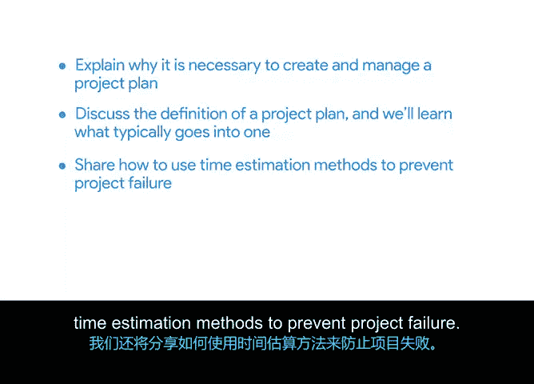

# 011：构建项目计划

## 📋 概述

在本节课程中，我们将学习如何创建和管理项目计划。我们将探讨项目计划的定义、核心组成部分，并介绍时间估算方法以及构建项目计划的工具与最佳实践。

## 📝 课程内容

上一节我们介绍了项目生命周期中的规划阶段，讨论了项目启动会、里程碑和任务设定。本节中，我们来看看为什么需要创建和管理项目计划。

我们将讨论项目计划的定义，并学习其典型组成部分。这包括项目时间表，它将指导你的团队走向终点。

我们还将分享如何使用时间估算方法来预防项目失败。

我们将介绍几种时间估算技术，帮助你构建准确的项目时间表。

最后，我们将探讨可用于构建项目计划的工具和最佳实践。

准备好开始了吗？我们下一个视频见。

## ✅ 总结

本节课中，我们一起学习了构建项目计划的必要性、其核心定义与组成部分，并预告了时间估算技术及实用工具。