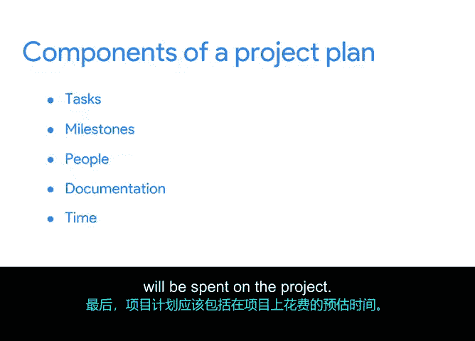

# 012：项目计划的组成部分 📋

在本节课中，我们将学习项目计划的核心组成部分。项目计划是项目管理的关键工具，它帮助你将项目的各个方面整合起来，确保团队目标明确、任务清晰。

## 项目计划概述

项目计划对任何规模的项目都很有用，因为它帮助你记录项目的范围、任务、里程碑和整体活动。

项目计划的核心是**项目进度表**。项目进度表可以帮助你估算完成项目所需的时间，并为团队提供一种对照目标跟踪项目进展的方法。

## 项目计划的五大基本要素

不同公司的项目计划内容可能有所不同，但大多数计划都包含以下五个基本要素：**任务**、**里程碑**、**人员**、**文档**和**时间**。

接下来，我们将逐一分解这些要素。

### 1. 任务与里程碑

项目计划将包含任务和里程碑，这是我们之前讨论过的两个主题。

*   **任务**：指需要在规定时间内完成的活动。它们根据团队成员的**角色**和**技能**被分配给不同的人。
*   **里程碑**：是进度表中的重要节点，用于标志进展。它们通常意味着一个**可交付成果**或项目**阶段**的完成。

### 2. 人员与角色

项目计划还应包括项目团队成员及其角色。确保每个团队成员都清楚自己的角色和需要负责完成的任务至关重要。这能让你腾出精力专注于项目管理，并在团队中建立个人责任感。

### 3. 相关文档

项目计划是链接相关文档的好地方。这包括：

*   **RACI矩阵**：帮助定义团队中个人的角色和职责。
*   **项目章程**：明确定义项目，并概述实现目标所需的细节。
*   **其他文档**：如**预算**和**风险管理计划**等。我们将在课程后续部分详细讨论这些内容。

### 4. 时间估算

最后，项目计划应包含项目预计花费的时间。这构成了**进度表**的基础，而进度表是你项目计划的支柱。

预计时间包括：

*   任务的**开始日期**和**完成日期**。
*   希望达到各个**里程碑**的日期。
*   项目的**总体开始日期**和**结束日期**。这些日期对于确定你所需资源及其需求时间非常重要。

## 总结

本节课我们一起学习了项目计划的五大核心组成部分：**任务**、**里程碑**、**人员**、**文档**和**时间**。理解这些要素是创建有效项目计划的第一步。

那么，如何准确估算这些任务和项目所需的时间呢？我们将在下一个视频中探讨这个问题。