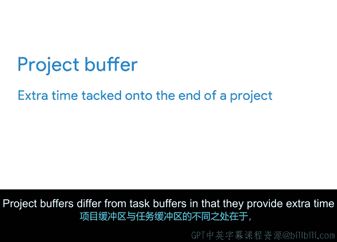

# 013：制定现实的时间估算 📅

在本节课中，我们将要学习如何为项目任务制定现实的时间估算。作为项目经理，你的核心职责之一是识别任务、分配任务，并估算其完成所需的时间。这些估算共同决定了整个项目的进度安排。我们将探讨时间估算与工作量估算的区别，以及如何使用“缓冲时间”来应对计划中的不确定性。

## 理解时间估算与工作量估算

上一节我们介绍了项目经理在任务规划中的角色，本节中我们来看看两种关键的估算类型：时间估算和工作量估算。

**时间估算**是对完成一项任务所需总时间的预测。**工作量估算**则是对完成一项任务所需的主动工作量和难度的预测。

两者的核心区别在于：工作量量化的是一个人为完成任务而投入工作的**纯工作时间**；而时间指的是任务从开始到结束的**总持续时间**，其中包含了非工作或等待的**非活跃时间**。

以下是两者的对比公式：

*   **工作量估算** ≈ 纯工作时间
*   **时间估算** = 纯工作时间 + 非活跃时间

例如，粉刷一面墙的工作量估算可能是30分钟，但时间估算可能是24小时。这是因为除了30分钟的主动粉刷时间外，还有23.5小时的等待油漆干燥的非活跃时间。

理解这一区别至关重要，因为它能帮助你更高效地利用可用资源。如果一项任务中包含了空闲时间，你的团队成员实际上可以在此期间自由处理其他工作。就像油漆工可以在墙面干燥时去粉刷邮箱或窗框。

## 如何制定现实的工作量估算

不现实的工作量估算会对项目进度产生负面影响。这种情况通常发生在你低估了完成任务所需的时间时。低估的常见原因是**过度乐观**。虽然乐观是项目经理的优秀品质，但过度的乐观可能导致你忽视那些可能使计划落后的潜在风险。

尽管假设所有任务都能完全按计划执行很诱人，但挫折总是有可能发生的。那么，如何尽量避免做出不现实的工作量估算呢？你可以通过与分配到每项任务的队友沟通来实现。

你的队友对完成任务所需的工作量有最现实的了解，应该能为你提供最佳的估算。让我们在Office Green公司的“植物力量”项目背景下想象一个场景。你正在推出一项新服务，为顶级客户提供可以放在办公桌上的小型、低维护植物。

你可能会认为创建一份顶级客户联系名单相对简单，可以在一天内完成。但在规划中，认真考虑完成工作所需的某些子任务非常重要。**子任务**指的是完成一项更大任务所需的较小任务。

以下是创建客户联系名单可能包含的子任务示例：

*   与全球销售团队会面以确定客户
*   收集联系信息
*   确定客户的语言偏好
*   建立一个电子表格来存放这些信息

向负责该任务的队友征求他们的估算，可能会得到更准确的估计，因为他们对工作本身以及完成任务的细微要求有更深入的理解。你可能会了解到，创建联系名单可能需要两天时间才能完成，这可能是你最初预期时间的两倍。当然，你通常可以根据需要提出后续问题，甚至温和地质疑他们的估算。稍后，我们将讨论更多可用于从队友那里获得更准确估算的技巧。

## 使用缓冲时间应对不确定性

现在，尽管任务负责人往往最清楚自己完成任务需要多少时间，但事实是，工作量估算终究只是**估算**。这意味着有时这些估算并不准确。例如，在我们的“植物力量”场景中，你的队友估计创建顶级客户联系名单需要两天。但假设销售团队外出进行团队建设活动，直到周末之后才能开会讨论客户名单，这将造成任务延迟，从而使最初的估算不再准确。

幸运的是，有一个有用的工具叫做**缓冲**，你可以在规划阶段使用它来应对不准确的工作量估算。

😊 **缓冲**是在任务或项目末尾额外增加的时间，用于应对工作中意外的减速或延迟。

缓冲很重要，因为它可以提供一些回旋余地，以防你的时间和工作量估算最终略有不足。通过设置缓冲，你可以在日程中增加额外时间，这样当任务延迟不可避免地出现时，你的项目也不应该偏离轨道。

在规划日程时，你可以使用两种类型的缓冲：**任务缓冲**和**项目缓冲**。

首先，我们有**任务缓冲**，它指的是附加在特定任务上的额外时间。任务缓冲应主要用于项目团队**无法控制**的任务。

例如，你可能会要求一个潜在的植物供应商在周一之前向你提供成本估算。你设定这个截止日期时，心里清楚实际上要到周四才需要这份估算。周一和周四之间的时间就是你的缓冲，它为你的团队提供了额外的时间，以防供应商晚一两天发送估算。

对于项目团队**可以控制**的任务，应更谨慎地使用任务缓冲。例如，你可能选择只对那些难以完成或具有不可预测因素的任务添加缓冲，比如植物生长所需的时间长度。为每项任务都添加缓冲可能会不必要地延长你的项目日程，给你、你的团队和利益相关者一个不切实际的时间表。

这时，**项目缓冲**就派上用场了。项目缓冲与任务缓冲的不同之处在于，它为整个项目日程提供额外时间。

与其为每项任务添加缓冲，不如在项目日程的末尾添加额外时间作为缓冲。然后，你可以在整个项目过程中根据需要（例如两到三天）使用这些额外时间。例如，如果有队友在这里或那里错过了截止日期，项目缓冲会在整体日程中为你提供弥补损失时间的空间。

我在谷歌的日常工作中经常使用缓冲。例如，在谷歌最近的一个项目中，我与一位新员工合作，他编码能力很强，但总是错过截止日期。我意识到他没有给自己留出足够的缓冲时间来进行测试。我开始询问他当前的工作量和任务的复杂性。基于他对这些问题的回答，我能够收集到关于他工作的见解，并确定需要在哪些任务上为他添加缓冲。

😊 最终，我的目标是确保为项目设定一个现实的时间表。毕竟，如果你的项目目标比预期晚了两个月才达成，你的组织可能不会认为该项目是成功的。

## 总结

本节课中我们一起学习了项目规划中制定现实时间估算的核心方法。我们首先区分了**时间估算**（总持续时间）和**工作量估算**（纯工作时间），并理解了非活跃时间的影响。接着，我们探讨了通过与任务负责人沟通来获得更准确工作量估算的重要性，并引入了**子任务**的概念以细化工作。最后，我们学习了使用**缓冲时间**（包括**任务缓冲**和**项目缓冲**）来管理不确定性，保护项目日程免受意外延迟的影响。掌握时间估算、工作量估算和缓冲技巧，将帮助你为达成项目目标制定出切实可行的计划。