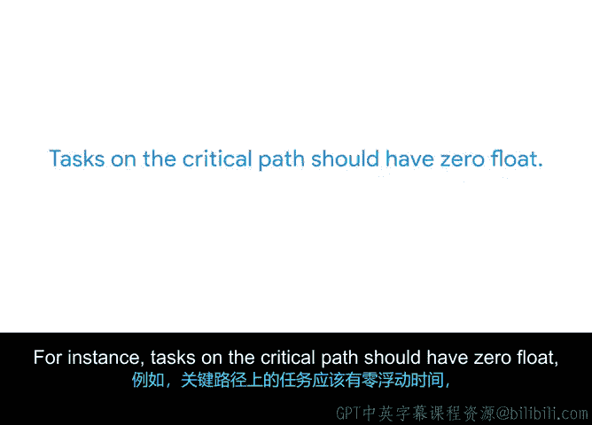

# 014：将一切整合起来

## 概述

在本节课程中，我们将学习项目规划中的两个核心概念：**容量规划**与**关键路径**。我们将了解如何评估团队完成工作的能力，以及如何识别项目中那些必须按时完成、否则会导致整体延误的关键任务序列。

---

## 容量规划：确保资源充足

上一节我们讨论了时间估算和工作量估算，这些技术能帮助你预测完成任务所需的时间。一旦掌握了这些信息，你就需要判断是否有足够的人手来完成工作。为此，你可以使用一种称为**容量规划**的技术。

首先，我们来定义**容量**。容量是指在特定时间段内，分配给项目的人员或资源能够合理完成的工作量。每个人的能力都是有限的，在分配工作时，牢记每个人的容量至关重要。

**容量规划**是指将人员和资源分配到项目任务中，并判断你是否拥有按时完成工作所需的必要资源的过程。在这个过程中，你可能会发现需要更多资源来加快项目进度，例如增加一名网页开发人员或一名文案。

让我们在Office Green公司的“植物力量”项目背景下想象一下容量规划。如果你知道需要在五天内向100位客户配送植物，那么你就需要判断是否雇佣了足够的送货司机来满足这个截止日期。如果一名司机平均每天工作八小时能完成四次配送，那么你就知道至少需要雇佣五名司机才能按时完成工作。

即使项目团队的某位成员将100%的工作时间都投入到你的项目上，他们每天能完成的工作量也是有限的。考虑到会议、突发的紧急任务以及典型工作日的其他事项，每个人能完成的工作是有限的。

---

## 关键路径：聚焦核心任务

那么，你如何决定团队成员应该优先关注哪些任务，以充分利用他们的容量呢？你可以通过规划项目时间线的**关键路径**来优先安排他们的时间。

**关键路径**是指为了按计划达成项目目标所必须达成的项目里程碑列表，以及促成每个里程碑完成的强制性任务。除此之外的任务都被视为**非关键路径**任务。

例如，启动“植物力量”项目的关键路径任务可能包括：雇佣植物供应商、开发新网站以及完成配送。而像在产品线中增加鲜花这样的任务，虽然很好，但可能对项目的整体成功影响不大。由于这个任务对项目启动并非至关重要，因此它不属于关键路径的一部分。

总而言之，你的关键路径包含了达成项目目标所需的最少数量的任务和里程碑。如果你的团队无法按时完成其中任何一项任务，都可能导致项目延误。

---

## 确定关键路径的步骤

以下是确定项目关键路径的步骤：

1.  **列出所有任务与里程碑**：首先，列出完成项目所需的所有任务以及它们所对应的里程碑。此时，回顾你的**工作分解结构**非常合适。WBS是一个图表，它将项目的所有里程碑和任务按照需要完成的顺序进行层次化排序，提供了每个项目任务的详细概览。

2.  **识别任务依赖关系**：然后，确定列表中的哪些任务必须在另一项任务完成后才能开始。这被称为**依赖关系**，我们将在后面详细讨论这个话题。

3.  **估算时间并绘制路径**：接下来，与你的团队合作，为每项任务进行时间估算，并从开始到结束绘制每项任务的路径。**最长的路径就是你的关键路径**。

---

## 影响容量规划的因素

有几个因素会影响容量和容量规划：

*   **并行任务与顺序任务**：你需要识别哪些任务可以**并行**发生（即可以与其他任务同时进行），以及哪些任务必须**顺序**发生（即必须按特定顺序进行）。识别并行任务有助于在项目时间表中创造效率，展示出可以在哪里同时完成多项任务。识别顺序任务则有助于确定在项目早期需要优先处理的任务。
    *   **示例**：对于“植物力量”项目，一个顺序任务可能是在雇佣供应商之前需要获得预算批准。而两个并行任务可能包括雇佣送货司机和开发网站。这些任务彼此无关，因为它们专注于项目的不同部分，可以由团队的不同成员完成。这意味着即使另一项任务尚未完成，一项任务也可以开始，因此完成这些任务的工作可以同时进行。

*   **固定开始日期**：你还需要确定哪些项目任务有**固定开始日期**。固定开始日期是指为了实现目标而必须开始处理任务的日期。识别任务是否有固定开始日期有助于容量规划，因为它有助于确保有足够数量的人员可以按时完成任务。
    *   **示例**：假设你的合同规定你需要在特定日期交付100株植物，这意味着提取这些植物的任务有一个固定开始日期，即交付日期的前一天。

*   **最早开始日期**：或者，有些任务可能有**最早开始日期**。最早开始日期是指你可以开始处理任务的最早日期。确定最早开始日期可以为供应商和团队成员何时能在项目上启动并运行设定准确的期望，从而帮助你相应地规划工作和确定优先级。
    *   **示例**：如果你正在与一个新供应商合作，你需要等到合同签署、采购订单被批准并创建之后，供应商才能开始工作。假设在Office Green，这个过程大约需要三周。基于此信息，你可以确定供应商的最早开始日期将是从与供应商的启动会议算起的三周后。

---

## 浮动时间：任务灵活性的指标

容量规划和创建关键路径的另一个最佳实践是识别任务是否具有**浮动时间**（有时也称为**松弛时间**）。浮动时间是指在不影响项目进度和威胁项目成果的前提下，你可以等待开始一项任务的时间量。这些是优先级高、几乎没有调整空间的任务。这有助于强化哪些任务在关键路径上，哪些不在。

**关键路径上的任务浮动时间应为零**，意味着没有延误的余地；而具有浮动时间的任务则不属于关键路径的一部分。

*   **示例**：向一位要求在特定日期收货的优先客户配送植物，就是一项浮动时间为零的任务。

---

## 总结

本节课中，我们一起学习了如何定义**容量**、进行**容量规划**以及识别**关键路径**。我们还讨论了用于识别项目中关键路径的技术，以及可能影响容量和容量规划的各种因素，包括并行与顺序任务、固定/最早开始日期以及浮动时间。

在下一个视频中，我们将继续学习如何在项目计划中创建可行的估算，并了解你的软技能如何帮助提升团队效率。