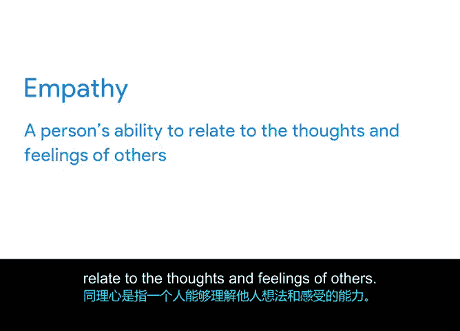

# 015：将一切整合起来

## 🕒 P15：从团队获取准确时间估算

在本节中，我们将学习如何通过与团队成员有效沟通，来获取准确的任务时间估算。时间估算和容量规划是制定项目进度表的关键技术，而这一切计划的核心正是你的团队。

在制定项目进度表的过程中，你需要与团队成员协作以收集估算，并在构建计划时考虑每个人的工作容量。让团队成员参与此阶段是合理的，毕竟，被分配特定任务的人最清楚完成该任务需要多长时间，也最了解自己承担工作的能力。

然而，这些沟通是双向的讨论。为了从团队获得最准确的估算，你需要运用你的软技能。软技能是帮助人们与他人有效协作的个人特质，包括我们在本课程中讨论过的关键沟通与人际交往能力。在试图理解可能阻碍某人发挥最佳工作能力的因素时，软技能尤为重要。

以下是运用软技能从团队成员处收集准确估算的三种方法：提出正确的问题、有效谈判以及践行同理心。

### 提出正确的问题

让我们从提出正确的问题开始。将围绕时间估算的对话视为一种访谈。你通过与团队成员沟通，来了解更多关于他们如何处理特定任务的信息，并利用这些信息来构建你的进度表。

为了从这些对话中获得最相关的信息，你需要确保自己提出的是有效的开放式问题，这些问题能引导出你寻求的答案。**开放式问题**是指不能用“是”或“否”来回答的问题，其答案能提供你需要了解的相关细节。

让我们在Office Green项目的背景下想象一下。你已经与网页设计师讨论了新网站的设计，并想知道他们需要多长时间来完成设计稿供你审阅。

如果你这样开始对话：“你能在一周内完成设计稿吗？”这是一个**封闭式问题**，可能只会引发简单的“是”或“否”回答，这并不能告诉你太多关于网站设计任务或你队友工作风格的信息。

现在，想象一下如果你用开放式问题开始对话。例如，你可以问网页设计师：“像这样的网站设计稿，你通常需要多长时间来完成？”这是一个**开放式问题**，更有可能引发更详细的回答。在此基础上，你可以继续追问后续问题，例如：“完成这项任务的步骤有多复杂？”“这项任务有哪些相关风险？”“你认为什么时候可以准备好？”

通过向团队成员提出关于其分配任务的有效开放式问题，你可以更多地了解他们的工作方式和内容。随着此类对话的增多，你会对团队成员的角色和任务有更好的理解，并且将能够减少对团队提供准确估算的依赖。

### 有效谈判

运用软技能从团队成员处收集估算的另一种方法是有效谈判。作为项目经理，你的部分工作是弥合项目的高层目标与团队的日常视角之间的差距。虽然你的项目可能是你的首要任务，但你的项目团队成员可能同时需要兼顾其他团队的竞争性任务。

有效谈判可以帮助你影响团队成员，通过协作找到一个对所有人都有利的结果，从而使你的项目成为他们的优先事项。

例如，假设网站设计师估算需要两周时间来制作网站设计稿供审阅，但你原本希望他们的估算能接近一周。为了达成一个对你和设计师都可行的估算，你可以通过提出后续问题来温和地挑战这个估算。

你可能会问，他们的估算是否包括为多个页面制作设计稿。如果是，你可以询问设计师能否在他们提出的截止日期之前，提前分享一两个页面给你。通过提问，你可以判断他们的估算是否有灵活性，或者你是否需要引入额外的设计师来支持进度。

通过与团队成员有效谈判，你可以营造对项目成果的共同责任感，并创建一个符合每个人工作量的进度表。

### 践行同理心

现在让我们讨论践行同理心的价值。**同理心**是指一个人理解他人想法和感受的能力。

在工作中践行同理心是建立团队信任的一种非常有效的方式。你的团队成员是人，每个人的能力都是有限的。当你与团队讨论估算时，可以通过询问每个人的工作量来践行同理心，这包括你项目之外的工作以及整体的工作与生活平衡。

你也可以询问他们是否在项目期间安排了休假，或者是否有他们不工作的关键节假日。这可以帮助你避免在团队成员无法按时完成任务时给他们分配工作。

例如，网页设计师可能会告诉你，他们也在为Office Green的另一个团队设计网站，并且两个项目的时间线有重叠。为了避免给你的设计师带来过重的工作负担，你可以与另一位项目经理合作，平衡跨团队的工作量。

人们希望自己的工作受到重视，因此同理心的一部分是记住要始终感谢团队为你提供的工作、协作和支持。

### 本节总结

在本节中，我们一起学习了如何通过运用软技能从团队获取准确的时间估算。具体方法包括：提出正确的开放式问题以获取详细信息；通过有效谈判协作达成可行的估算；以及践行同理心，理解团队成员的工作负荷和限制，从而建立信任并制定更现实的计划。

接下来，我们将讨论如何在项目计划中有效地运用这些估算。