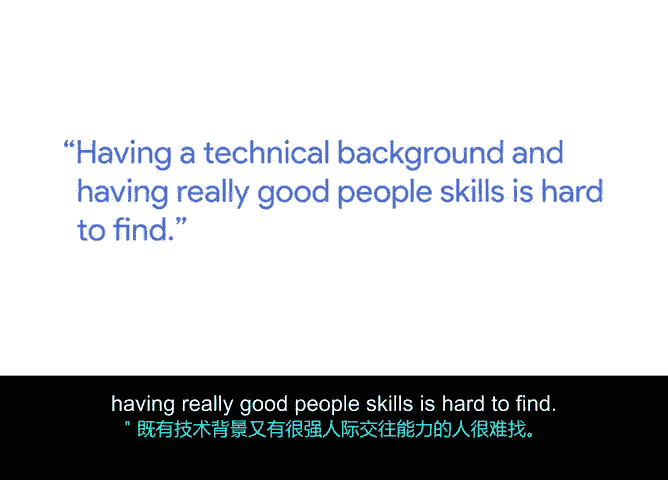
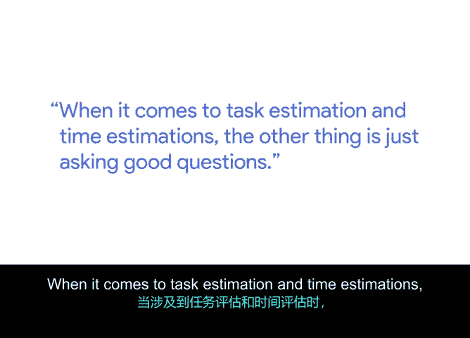

# 016：人际沟通技巧在时间估算中的价值 👥

在本节课中，我们将探讨人际沟通技巧（或称“软技能”）在项目时间估算中的关键作用。我们将了解如何通过理解团队和提出有效问题，来获得更准确、更全面的估算，从而推动项目成功。

大家好，我是安吉尔，是谷歌的一名项目经理。我的学位是机械工程。

我毕业后的第一位老板曾说，你是一名合格的工程师，但你的人际交往能力非常出色。同时具备技术背景和优秀的人际交往能力是很难得的。

## 理解软技能与情商 🤔

上一节我们介绍了软技能的重要性，本节中我们来看看它的核心。对我而言，软技能与情商有很大关系。这意味着能够读懂他人，并最终真正了解自己，能够读懂团队，理解他们的需求。但同时，你也要清楚自己的行为：我是在以好的方式、坏的方式，还是仅仅以不同的方式影响团队？

有时，主动邀请那些通常不举手发言的人提供意见，会带来很大帮助。因为很多时候，那些可能更安静的成员正在认真思考问题，并且可能有很多见解。如果你没有察觉到这一点或没有询问他们，你可能会错过这些宝贵信息。因此，对我而言，软技能就是真正理解团队的情感需求，这能切实帮助你，无论是在估算、成本（无论是人力还是资金方面）时，都能从团队那里获得更全面的视角。

## 在任务与时间估算中的应用 ⏱️

在涉及任务估算和时间估算时，另一项关键是提出好的问题。不仅仅是说“我需要你加快速度”，而是真正地沟通。

以下是提出有效问题的一些方法：

*   **探讨可能性**：询问“如果我给你提供[某项资源]，你能加快多少？”
*   **识别障碍**：询问“是什么阻止你更快地完成？”
*   **寻求协作**：询问“你需要哪些团队参与来帮助解决这个问题？”或者“我们遇到了一个问题，这个项目的其他部分是否存在类似问题？我们是否需要召集一个更大的小组来共同解决？”

我认为，作为项目经理，你的角色就是发现项目中的模式，识别事情是在放缓还是完全停滞，并运用这些软技能将团队凝聚起来解决问题。

## 识别问题与促进学习 🔍

甚至仅仅是发现问题本身，承认问题的存在，而不是一味指责。真正要做的是深入挖掘，思考“我们如何从中学习？我们如何修复它？我们如何继续前进？”

一些有帮助的做法还包括与你的团队成员建立联系。如果你曾处于类似境地，或者只是试图理解他们的工作流程，有时仅仅让人们大声说出他们的估算过程，就能让他们自己意识到“哦，我们可以通过讨论来节省更多时间或改进这一点”。

## 项目管理技能的普适性 🌐

我曾担任过各种项目的经理，从制造标签的机器到火车机车引擎，再到胶合板制造。项目管理技能并不一定与你所处的特定领域完全相关。它更多地关乎方法、流程，以及你如何构建团队并促使人们协同工作。

## 总结 📝

本节课中，我们一起学习了人际沟通技巧在项目时间估算中的核心价值。关键在于运用情商理解团队需求，通过提出开放式、引导性的问题（例如：“**如果提供X资源，能加快多少？**”或“**是什么阻碍了进度？**”）来挖掘深层信息，并主动邀请所有成员参与。项目经理的角色是识别项目中的模式与障碍，促进团队协作与共同学习，这些软技能是超越具体行业、推动项目成功的通用方法。