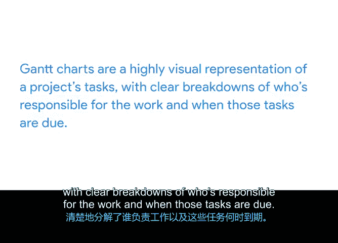

# 017：将一切整合起来

## P17：17_02_01：制定项目进度表

在本节课程中，我们将学习如何整合项目信息，制定清晰的项目进度表，并介绍创建进度表的实用工具。

在之前的视频中，我们介绍了几种不同的时间估算方法。现在，你可以理解如何运用这些方法来预防项目失败。

接下来，我们将讨论如何将所有信息整合到一个项目计划中，以帮助你及团队保持正轨，达成目标。

即使是最简单的项目，也能从清晰的计划中受益。一份优秀项目计划的核心，是一个包含项目所有任务、负责人及完成时间的明确进度表。一旦你拥有了项目进度表，就可以围绕它，使用电子表格等工具构建一个坚实的计划。我们稍后会解释这些工具，但首先，让我们讨论如何构建项目进度表。

### 📊 甘特图：可视化项目进度

有许多有用的工具可以用来创建项目进度表，但我们将重点介绍谷歌内部有时会使用的一种工具：甘特图。

甘特图是一种用于映射项目进度的横向条形图。一个有趣的事实是，该图表以美国工程师亨利·甘特的名字命名，他在20世纪初帮助推广了这种图表。

那么，为什么项目管理从业者觉得这个图表有用呢？因为它能以高度可视化的方式呈现项目任务，清晰地分解出工作负责人和任务截止日期。

对许多人来说，在书面指示基础上构建的可视化辅助工具，是理解并同步他们所需工作、完成时间以及个人任务如何与项目中其他任务相关联的有效方式。

甘特图几乎就像日历。它们标注了每个任务的开始和结束日期，条形长度与分配给每个任务的时间量相对应。例如，假设你的队友利昂负责创建项目章程，而另一位队友凯莉则负责在利昂完成后审阅和编辑章程。使用甘特图，你可以用彩色条形图来说明他们处理这些任务的工作日。

通过这种方法，你和团队其他成员可以确定利昂有周五、周一和周二的时间来撰写章程，而凯莉则有周三来完成修订。条形图在图表中依次向下排列，以说明时间的推移以及任务完成的时间段。

### 🛠️ 创建甘特图的工具

甘特图是跟踪进度的有用工具。那么，你可以使用哪些工具来制作甘特图呢？有几种选择，但我们将重点介绍简单直接的电子表格。

在电子表格中创建甘特图相当简单。你可以按以下项目组织左侧的列：任务ID、任务标题、任务负责人、开始日期、截止日期、持续时间和任务完成百分比。这是列出先前在工作分解结构中确定的任务和里程碑的好地方。你将在下面的行中包含相关信息，并按开始日期组织。

在表格的右侧，你将按项目从开始到结束预计完成的周数来排列列。在下面的行中，你将包含代表特定任务发生日期的条形图。

这很简洁，对吧？电子表格在这里很有用，因为它们可以容纳比甘特图更多的信息。虽然项目进度表是项目计划的核心组成部分，但你可以在电子表格中使用单独的标签页来存放或链接到计划中需要包含的其他文档，例如RACI矩阵或项目章程。你也可以选择在此处包含你的风险管理和沟通计划。

使用电子表格，你可以简单地添加一个标签页来存放你的文档。将所有项目文档保存在一个电子表格中可以节省时间，帮助每个人保持条理，并减少在电子邮件中搜索信息的负担。

或者，你也可以选择使用数字文档来链接所有相关文档。

### 🔄 选择适合你的规划工具

虽然甘特图是一个有用的工具，但它远非你项目计划的唯一选择，并且有很多理由表明这种文档形式可能不适合你或你的项目团队。

对于一个简单的项目，你可能会发现你的团队对包含任务列表、负责人、截止日期以及指向其他相关规划文档链接的数字文档反应更好。

或者，也许你的团队最适合使用看板。看板使用卡片来跟踪和可视化任务的进度。

无论你选择何种工具，只要你的计划包含了项目目标、任务、负责人、起止日期以及相关的规划文档，那么你就能让所有人保持一致。

现在你对用于创建项目进度表的工具有了更多了解。接下来，我们将讨论构建项目计划的最佳实践。下个视频见。

---

**本节课总结**：在本节课中，我们一起学习了如何将时间估算结果整合到项目计划中，重点介绍了使用甘特图作为可视化工具来制定项目进度表的方法，并探讨了电子表格等实现工具及其替代方案，强调了选择适合团队的工具以清晰呈现任务、负责人和时间安排的重要性。