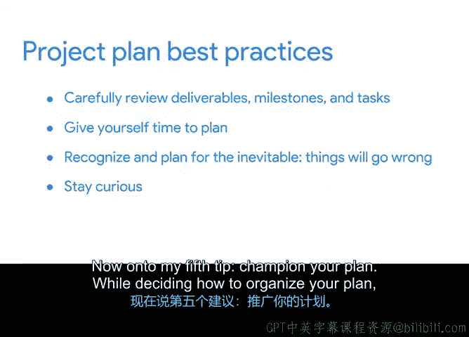

# 018：项目计划最佳实践 🎯

在本节中，我们将探讨构建一个优秀项目计划的五个最佳实践。这些实践能确保你的计划在项目执行和收尾阶段持续有效，帮助你和团队顺利推进工作。

## 概述

之前我们学习了如何基于项目时间表创建项目计划，时间表列出了项目的所有里程碑、任务和截止日期，并明确了每项任务的负责人。我们还介绍了甘特图，这是一种创建时间表的简单可视化方法。那么，如何确保你的计划对你和团队真正有用呢？接下来，我们将讨论五个关键的最佳实践。

## 确保仔细审查项目可交付成果、里程碑和任务

在项目启动阶段，你创建了项目章程，其中包含了项目目标、范围和可交付成果等重要信息。当项目进入规划阶段时，计划需要更加细化。

以Office Green公司的项目为例。在计划中，你需要将这些信息进一步分解。例如，为服务创建一个新网站是一个可交付成果，你需要将其分解为更小的里程碑，比如与网站开发人员召开启动会议、获得利益相关者批准。而这些里程碑又可以分解为更小的任务，例如制作新网站的设计模型、开发着陆页面。

每项任务都将分配给一位团队成员，并设定开始和结束日期。新网站并非唯一的可交付成果，你需要将每个可交付成果都分解为里程碑和任务，以确保你和团队对实现项目目标所需的工作有清晰的认识。

你的计划围绕着完成每一项微小任务展开，因此你应该花时间把这一部分做好。

## 给自己留出规划时间

规划之所以成为项目生命周期中的一个独立阶段，是有原因的。这是一个耗时的过程，特别是对于具有多个可交付成果的大型项目。

规划让你和团队有时间现实地思考，在特定时间范围内团队能够完成和不能完成什么。你和你的队友都不是机器，任何一个人在给定时间内能完成的工作量都是有限的。

使用我们之前分享的策略，如**工作量估算**和**产能规划**，可以帮助你和团队对项目所需时间以及何时能达到里程碑有一个现实的认知。

同时，为缓冲时间留出余地也很重要，因为项目很少完全按计划进行。在项目后期，你会感激最初在时间安排上计划了一些内置的灵活性。

## 预见并规划不可避免的问题

即使规划得再周密，你的项目仍会遇到意想不到的挫折和障碍。你无法为每个问题都做好计划，但团队可以识别最可能发生的风险，并制定计划来预防或减轻这些风险。

正如我们之前提到的，**缓冲时间**是缓解进度放缓相关问题的有用工具。在本课程后面，你将学习如何创建风险管理计划，并将其纳入你的项目计划。

## 保持好奇心

虽然你可能是整个项目的唯一专家，但你不太可能是项目每项任务的专家。这就是为什么在规划阶段与你的队友坐下来，提出大量问题如此重要。

正如我们之前提到的，向队友询问他们的工作可以让你更深入地了解他们的项目任务。他们的意见将帮助你制定更强大的计划，而反复的对话将有助于在你和队友之间建立信任。

为了保持项目顺利进行，了解利益相关者和供应商的期望、优先级、风险评估和沟通风格也很重要。例如，你可以询问利益相关者如何最好地让他们了解项目计划的最新情况。你也可以询问供应商他们完成项目工作的可用性。

## 积极倡导你的计划

在决定如何组织你的计划时，你需要问自己几个问题：你的队友能使用你用来构建计划的工具吗？信息对你的利益相关者来说足够清晰吗？将此计划作为单一事实来源，是否能在团队和利益相关者需要查找项目信息时，为他们节省时间和精力？

如果每个问题的答案都是肯定的，那么你就走在了正确的轨道上。

为了获得队友和利益相关者对项目计划的支持，请积极倡导它。告诉你的团队，紧跟计划对他们有什么好处。这样做，你可能会影响你的队友保持正轨并定期更新计划。

## 总结

在本节中，我们一起学习了确保项目计划成功的五个最佳实践：仔细审查可交付成果、里程碑和任务；给自己留出充足的规划时间；预见并规划可能出现的问题；保持好奇心，积极沟通；以及在计划定稿后积极倡导它。遵循这些实践，将为你的项目执行奠定坚实的基础。