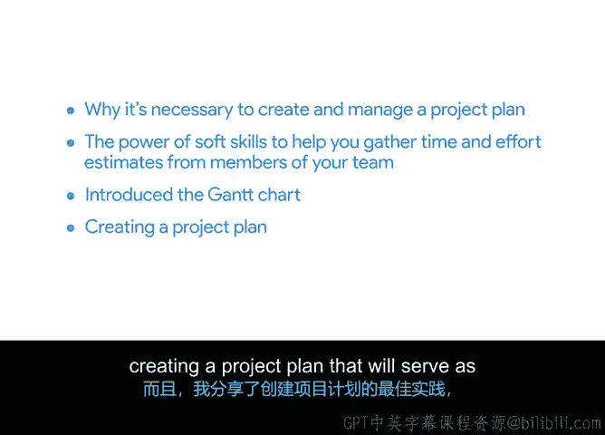

# 019：19_02_01_总结_2

## 📚 概述
在本节课程中，我们将回顾并总结项目规划阶段的核心内容，涵盖从创建项目计划到使用甘特图等工具的关键知识。

## 🔄 内容回顾
上一节我们探讨了项目规划的具体工具，本节中我们来总结项目规划阶段的核心要点。

以下是我们在本节中共同学习的关键内容：

*   **项目计划的必要性**：我们首先阐述了为何需要创建并管理一个项目计划。项目计划的核心是**项目进度表**。
*   **任务估算方法**：我们讨论了如何为每项任务确定**现实的时间与工作量估算**。
*   **软技能的应用**：你进一步学习了**软技能**的力量，它能帮助你从团队成员那里收集时间和工作量估算。
*   **甘特图工具**：我们向你介绍了**甘特图**，这是一种用于可视化项目进度的实用工具。
*   **最佳实践分享**：我分享了创建项目计划的**最佳实践**，以确保该计划能在整个规划阶段和执行阶段作为有用的信息来源。

## 🎯 总结
本节课中，我们一起学习了项目规划的核心要素，包括创建以进度表为中心的项目计划、进行任务估算、运用软技能收集信息、以及利用甘特图进行可视化规划。

## 📈 后续预告
接下来，我们将带你学习如何管理成本与预算。