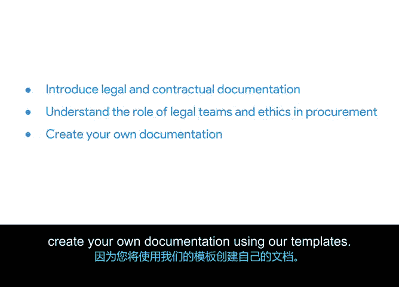

# 020：将一切整合起来

## 第20章：管理预算与采购

### 20_03_01：引言：管理预算与采购

欢迎回来。

在上一节中，我们学习了如何创建和管理项目计划，以及如何运用时间估算来预防项目失败。

本节中，我们将把讨论转向项目预算的内部运作机制。

现在，让我们来谈谈资金问题。

如前所述，许多项目管理技能可能与你日常生活中已经使用的常见技能有所重叠。

你可能已经拥有一些预算编制的经验。

项目管理领域的预算编制是一个复杂的过程，涉及多方参与和大量文档。

我将教你如何创建和管理一个真实世界的项目预算。

我们将讨论预算的众多组成部分，以及利益相关者在预算过程中扮演的角色。

你将了解到采购在项目管理中的重要性。如果你还不清楚这个概念的含义，请稍安勿躁，很快你就会理解。

你还将学习在敏捷和传统方法论背景下，如何进行供应商管理和采购。

在整个过程中，会引入一些围绕法律和合同文档的新概念。

例如 **NDA**（保密协议）、**RFP**（建议邀请书）和 **SOW**（工作说明书）。你将了解到项目经理需要精通各种缩写术语。

很快你也会掌握。接下来我会逐一解释这些缩写。

我们还将教你法律团队和道德规范在采购中所扮演的角色。

给你一个提示：这个角色非常重要。启动新项目、寻找材料和供应商时，如果不考虑道德影响，可能会让项目经理陷入困境。

因此，你将了解更多关于法律团队和道德规范的知识，以帮助你避开这些棘手的情况。

最棒的部分是：你将获得相当实际的动手经验，因为你将使用我们的模板创建自己的文档。

你准备好了吗？我们将在下一个视频中开始。

