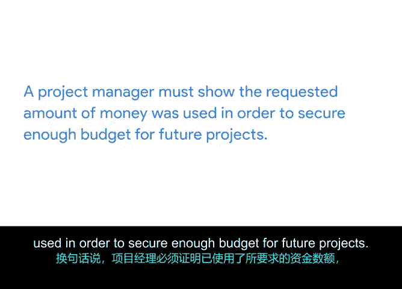

# 021：将一切整合起来

## 第21章：预算设置的重要性 💰

在本节中，我们将探讨项目预算的核心概念、其重要性以及创建和管理预算的关键流程。理解预算对于项目的成功至关重要。

---

让我们回到预算这个话题。你可能已经为个人生活设定了预算，以帮助控制月度开支。许多人这样做，因为这能让他们感到对财务状况有所准备和掌控。

项目预算也是如此。项目预算比个人预算更复杂一些，它将帮助你更深入地理解项目预算所包含的内容。**项目预算**是指为实现项目目标所需的预估货币资源。在审查项目预算时，你需要考虑完成项目所需的所有潜在和预计成本。

你将预算按**里程碑**进行分解。里程碑是项目时间表中的重要节点，标志着进展，通常表示一个可交付成果或项目阶段的完成。同时，你还需要列出各项活动和任务及其相关成本。这确保你能为特定时间段计算出正确的费用。

这被视为一种**预测**。项目预算的预测是在一段时间内的成本估算或预测。你需要经常审查项目预算，并且它会在整个项目生命周期中不断演变。这些预算通常包含诸如**人力成本、运营成本**，以及获取必要材料（如硬件、软件或设备）相关的成本。

项目预算的重要性远不止于省钱。在项目管理中，预算本身被视为一个**可交付成果**，也是一个成功指标。项目预算是一种工具，用于向利益相关者精确传达需要什么以及何时需要。预算将直接影响公司的财务生存能力。因此，你现在可能已经明白，它是项目管理不可或缺的一部分。

预算创建发生在项目的启动阶段。请记住，预算将在项目的整个生命周期中根据需要进行调整。根据你在公司中的角色，你并不总是预算的唯一制定者。你对预算和供应商关系等事项的所有权，可能会因公司规模、支持团队规模或团队组织结构等因素而有所不同。

尽管你可能并不总是从头到尾管理预算，但预算和里程碑是紧密相连的，因此了解预算在整个项目中的方方面面对你来说非常重要。

作为项目经理，你可能需要负责获取支出批准。大多数公司都有签署或支出政策。这通常规定了谁有权代表公司承诺资源、产生成本或承担其他义务。这一点很重要，因为如果你不知道某些活动将花费多少成本，以及是否有必要的可用资金，你将无法继续推进某些可交付成果或行动项。在不先检查租金成本的情况下租用房产是毫无意义的，对吧？如果租金价格高于你的预算，这一点尤其正确。同样的思路也适用于你的项目预算。

预算流程通常与进度安排流程同时进行，因为进度安排流程的步骤高度依赖于成本。项目经理将与项目相关人员合作，共同创建他们的估算。在大多数情况下，成本估算过程完成后，通常由项目发起人或另一位关键利益相关者审查并批准估算成本，并在必要时为项目调整和重新分配资金。

这可能意味着首席执行官或首席运营官是给予批准或最终签字的人。例如，在我们的“办公室绿化”项目中，产品总监拥有签字批准权。正如我们之前提到的，项目经理很可能需要财务部门的某种签字批准。这因公司而异，因此请确保你了解公司的流程。

项目预算从来不是“一刀切”的操作。作为项目经理，你必须优先考虑在项目内分配资金的地方，以确保产出最大化。最终，大多数项目都是为了提高员工生产力、增加收入或试图在组织内节省成本而创建的。预算是项目管理最重要的方面之一。而当你开始执行时，保持在预算内是最棘手的任务之一。不超过预算、不给公司带来额外成本非常重要。同样，预算不足也同样重要，因为这可能会影响公司下一年的预算。

对于像谷歌这样的上市公司或你当地的教育部门这样的公共部门组织等高知名度企业，它们可能有义务向股东或审计师报告其财务业绩。预算超支或不足过多，将改变公司下一年的预算方式，可能导致你未来可用的资金减少。换句话说，项目经理必须证明所申请的资金已被使用，以便为未来的项目争取到足够的预算。

对于小型企业，预算可能更紧张，在这种情况下，特别需要谨慎对待项目支出超过最初分配金额的情况。

理解预算对你作为项目经理的整体成功非常有帮助。因此，在下一个视频中，我们将学习预算具体包含哪些内容。