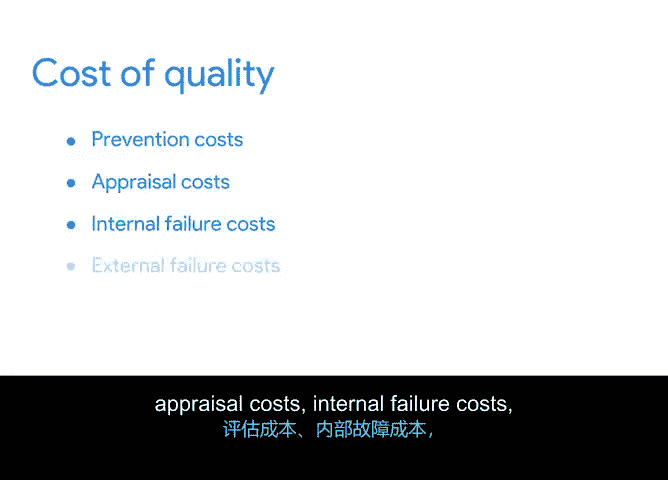

# 022：项目预算的关键组成部分 💰

在本节课中，我们将要学习项目预算的具体构成要素。你将了解到，制定预算不仅仅是设定一个总金额，还需要综合考虑多种因素，如资源成本、风险储备和质量成本等。

上一节我们介绍了预算的基本概念，本节中我们来看看构成预算的具体关键组成部分。

## 预算的复杂性

项目预算并非简单地设定一个总金额。企业不能随意决定项目花费，就像你不能决定超市里苹果的价格一样。项目经理必须考虑诸多因素，包括理解利益相关者的需求、为意外开支做预算、保持预算的适应性，并在整个项目过程中进行审查和重新预测。

以下是这些因素在“办公室绿化项目”中的具体体现：

*   **理解利益相关者需求**：产品总监作为项目发起人，需要项目控制在特定成本内以实现盈利。
*   **预算意外开支**：例如，供应商送来的几个花盆在运输途中破损，可能需要额外订购，产生计划外成本。
*   **审查与重新预测**：这意味着根据项目实际进展，创建一份独立的修订预算。例如，你可能发现最初高估了植物成本，而低估了营销费用，从而可以在预算内重新分配资金。

## 预算的关键构成要素

在制定预算时，需要考虑以下几个关键要素：资源成本费率、储备分析、应急预算和质量成本。

以下是每个要素的详细说明：

*   **资源成本费率**
    资源成本费率即获取和使用资源所需的费用。资源包括劳动力、工具、设备、材料和软件等。你需要确定每项资源将花费公司多少成本。公式可以表示为：
    `总资源成本 = ∑(资源单价 × 资源数量)`

*   **储备分析**
    进行储备分析有助于你规划可能需要的缓冲资金。该方法旨在审查所有潜在的项目风险，并判断是否需要增加缓冲资金，以应对最初未预见的新成本。

*   **应急预算**
    应急预算是项目管理中，为覆盖成本估算中未考虑的潜在不可预见事件而预留的资金。其目的是弥补成本和时间估算中的不确定性，以及不可预测的风险敞口。

*   **质量成本**
    质量成本是指为防止产品、流程或任务出现问题而产生的所有费用。它包括：
    *   **预防成本**：用于防止错误发生的费用（如培训、流程设计）。
    *   **鉴定成本**：用于评估产品是否符合要求的费用（如测试、检查）。
    *   **内部失败成本**：产品交付前发现缺陷所产生的费用（如返工、废品）。
    *   **外部失败成本**：产品交付后发现缺陷所产生的费用（如保修、退货、声誉损失）。

## 预算的估算与调整

将资源成本费率、储备分析、应急预算和质量成本这些因素应用到预算中后，你就可以估算项目的总成本了。请记住，预算很可能会发生变化。从一个初步估算开始，是确保项目至少步入正轨的一种方法。预算发生变化是正常的，这正是我们需要进行审查和重新预测的原因。

希望你现在已经开始注意到制定预算的基本框架。在下一课中，我们将开始动手把预算的各个部分整合起来。

本节课中我们一起学习了项目预算的关键组成部分，包括理解其复杂性、掌握资源成本、储备分析、应急预算和质量成本等核心概念，并认识到预算是一个需要持续审查和调整的动态工具。