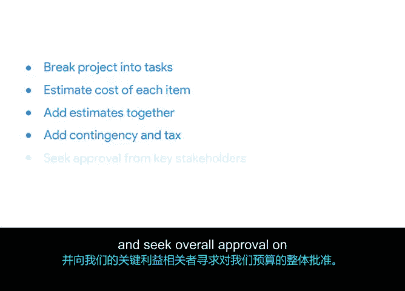

# 023：创建项目预算 💰

在本节课中，我们将学习如何创建一个详细且实用的项目预算。预算不仅是数字的集合，更是确保项目在财务上可行、并帮助项目经理控制成本的核心工具。我们将从零开始，一步步了解构建预算的最佳实践。

上一节我们介绍了预算的重要性，本节中我们来看看如何具体地创建一个项目预算。

## 预算的起点：方法与资源

创建预算时，有多种资源和策略可以确保你的估算既不高也不低。以下是几种核心方法：

*   **研究历史数据**：回顾过去类似的项目，了解其成本构成。这能帮助你借鉴前人经验，避免重复错误。随着项目管理经验的积累，你可参考的历史数据会越来越多，估算也会越来越准确。
*   **借助专家力量**：“借助”意味着充分利用其优势。向曾参与类似项目的同事或领域专家请教，能有效提升预算的准确性。作为初级项目经理，这是宝贵的资源。若咨询公司外部人士，务必注意不要泄露任何公司机密信息。
*   **采用自下而上法**：这意味着从头到尾思考项目的所有组成部分。具体做法是列出所有材料、资源、合同工等涉及成本的项目，并将它们加总。你还应该向潜在的供应商索取报价，以粗略估算其工作成本。

## 预算的确认与基准

在利用上述资源创建初步预算后，工作并未结束。接下来需要完成两个关键步骤：

1.  **确认准确性**：你需要仔细检查预算中的所有条目，确保其准确无误。
2.  **设定基准**：你的**基准**是一个具体的金额数字，用于在整个项目过程中衡量实际支出是否在正轨上，并最终衡量项目的成功与否。公式可以表示为：
    > **项目成本基准 = 经批准的总预算**

一旦设定了基准，你还需要根据项目的实际进展，定期回顾并调整这个数字。实时进行调整是项目经理的常规工作。项目规模和公司要求将决定你重新审查和更新预算的频率。

## 实战演练：分解任务与估算成本

以“Plant Power”项目为例，我们建议将项目分解为具体的任务，这正是自下而上法的应用。

以下是具体步骤：

1.  **分解任务并分配成本**：例如，创建新服务需要雇佣设计师和开发者来构建网站和应用程序。列出这些任务后，你需要协商员工分配、承包商费率，并多方比较供应商和交付服务的价格，从而为每项任务分配成本估算。
2.  **计入材料成本**：你需要考虑团队和利益相关者所需的设备。例如，是否有残疾员工需要工作场所改造？远程员工是否需要家用办公硬件？这里需要包含从电脑到与项目启动相关的所有软件。此外，是否还需要空间来存放各种植物或物资？“各种”是一个术语，代表未包含在其他类别中的额外物品，通常是次要或数量很少的物品。
3.  **添加其他费用项**：
    *   **固定成本**：在项目期间不会改变的成本。例如，花费50美元在招聘板上发布网页开发职位的广告，这就是一次性固定成本。
    *   **可变成本**：如差旅费和餐费。
    *   **应急储备**：你需要为后续可能出现的意外成本留出余地。确保给自己一些缓冲空间。我们选择将项目总预算的5%作为应急储备，这是一种标准做法。根据你对项目已知细节的多少，可以调高或降低这个百分比。客户需要知晓这部分缓冲，以防支出开始超标。若发生这种情况，你需要与客户共同解决问题并商定调整项目范围。

## 跟踪与控制：计划 vs. 实际

你需要在预算表中包含“计划成本”与“实际成本”两列。这样，你可以在项目的每个阶段跟踪成本。本课程的相关阅读材料将提供具体的预算模板，帮助你深入理解这个过程。

请记住，每个项目都会有**估算成本**和**最终成本**。你的目标是让估算成本尽可能接近最终成本。在项目进行中，你可能需要重新校准估算，这时就需要用到“完成项目所需估算成本”。如果你的预算没有完全命中目标，项目的最终成本将与预测或估算成本不同。

虽然目标是尽可能接近原始估算，但这并非总能实现。每当你接手一个新项目时，回顾以往项目的最终成本并审视你与目标的接近程度，将大有裨益。

本节课中我们一起学习了创建项目预算的完整流程：从利用历史数据和专家意见，到采用自下而上法分解任务、估算各项成本，再到设定基准、纳入应急储备，并建立跟踪机制。掌握这些步骤，是确保项目财务健康的关键。

接下来，我们将讨论如何维护预算。