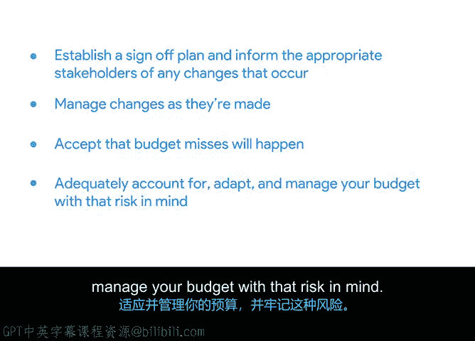

# 024：项目预算的维护与管理 💰

在本节课中，我们将学习如何有效维护和管理项目预算，并探讨预算管理中可能遇到的挑战，例如预算超支或结余。我们将介绍监控预算的方法、成本控制的重要性，以及预算偏差对项目可能产生的影响。

上一节我们介绍了如何创建项目预算，本节中我们来看看如何在实际执行过程中维护和管理这个预算。

## 定期监控预算 📊

定期检查预算对项目经理至关重要，它能确保在财务和运营层面，既定计划得到实际执行。监控预算意味着你需要持续追踪支出，以判断项目是否保持在预算范围内。

## 利用里程碑作为检查点 🎯

里程碑是项目进度的重要标志，通常代表一个可交付成果或项目阶段的完成。它们是跟踪项目进展的指标，也是重新审视预算的理想时机。

以下是里程碑在预算管理中的关键作用：
*   **预算审查点**：在里程碑节点，可以评估预算执行情况，判断是否需要调整。
*   **付款依据**：合同可能约定在特定里程碑节点付款，而非项目结束时。
    *   **固定总价合同**通常在达成里程碑时付款。
    *   **工料合同**通常按月支付，基于工作小时数及相关费用（如差旅、餐费）。

## 实施成本控制 🛡️

成本控制是项目经理识别可能影响预算的因素，并采取有效措施以最小化偏差的实践。这是一种主动的预算管理方式，远比被动应对更为有效。被动应对往往意味着预算已经出现了问题。

为了有效控制成本，你需要建立一个审批计划，并就任何变更通知相关干系人。

以下是实施成本控制的关键步骤：
*   **明确审批流程**：确定由哪位干系人或发起人负责批准承包商/供应商的工时表和发票。
*   **管理变更**：确保项目预算内的任何变更都经过各方同意。不应批准未经同意或超出项目范围的成本或项目。
*   **建立商业论证**：在向干系人提出变更前，确保有充分的商业理由。
*   **更新与追踪**：随着变更的发生，及时更新预测或估算，并追踪所有记录。避免对预算变更感到意外，也避免不断向干系人申请更多资金。定期复核预算数字可以预防这种情况。

## 接受并管理预算偏差 ⚖️

预算偏差总会发生。项目经理的职责是将预期的成本超支控制在可接受的限度内。在项目开始前，应与项目发起人和关键干系人协作，共同确定一个可接受的偏差限度（例如1%、10%）。

## 理解预算偏差的影响 🔍

我们之前简要讨论过项目超支或结余的后果。项目超支可能意味着公司用于其他业务的资金减少。现在，让我们更深入地探讨项目结余（低于预算）对公司的影响。

尽管低于预算看似是项目经理的理想情况，但实际上并非如此。

以下是项目低于预算可能带来的问题：
*   **管理不善的指标**：低于预算可能表明项目管理不尽如人意。
*   **初始估算不准**：这可能意味着最初的估算工作做得不好。
*   **资源投入不足**：表明本可以在项目上投入更多资金，可能意味着错失了获得额外资源或产出更高质量成果的机会。
*   **未来预算被削减**：公司可能会认为既然这个项目能低于预算完成，未来的项目也可以，从而导致未来项目的预算被削减。

因此，最佳选择是充分考虑风险，对预算进行充分的规划、调整和管理。

在后续课程中，我们将更深入地探讨其他能为公司节省资金和时间的策略，并学习识别和管理风险的详细方法。

下节课，我们将学习采购管理。稍后见。

---

本节课中，我们一起学习了如何通过定期监控、利用里程碑、实施主动的成本控制来维护项目预算。我们认识到，无论是预算超支还是结余，都可能带来挑战，因此需要在项目前期设定可接受的偏差范围，并以专业的态度管理整个预算生命周期。