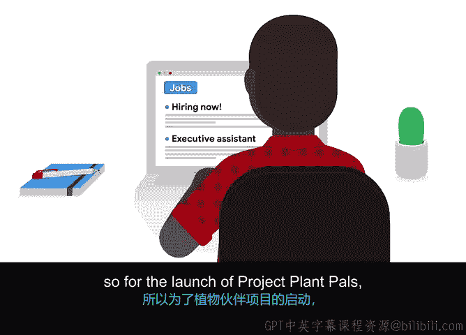

# 025：理解采购

在本节课程中，我们将学习项目规划中的一个关键环节：**采购**。我们将了解什么是采购，它与供应商管理的关系，以及它在项目中的具体应用。

---

## 采购的定义与类比

之前，我们曾将项目管理比作开始一项新的爱好。

假设你打算学习绘画。为了绘画，你需要购买或**采购**绘画用品和材料。首先，你需要问自己需要哪些用品。你打算从哪种颜料开始？是油画颜料、水彩颜料还是丙烯颜料？你打算在画布、木板还是纸张上作画？在采购材料之前，你需要研究这些选择。

一旦研究完成，你就可以开始采购材料、安排课程、观看教程。这样，你就踏上了成为下一个弗里达·卡罗的道路。

因此，正如你可能已经猜到的，**采购**指的是获取完成项目所需的所有材料、服务和用品。

---

## 供应商管理：采购的延伸

你还需要**采购供应商**。供应商是提供必要商品和服务的个人或企业。

因此，可以将**供应商管理**视为针对个人或企业的采购。供应商管理涵盖了研究和寻找供应商的活动。与采购材料不同，供应商管理通常涉及寻找特定的服务或人才，并管理这种合作关系。

寻找人才包括研究并获取你可能在项目中使用的不同合作公司的预估成本。当供应商提供你公司内部不具备的专业技能时，你通常会使用他们。

---

## 供应商管理的具体职责

供应商管理包含以下职责：

*   **寻找供应商**：识别潜在的合作方。
*   **获取报价**：从供应商处获得其工作的费用估算。
*   **评估选择**：判断哪些供应商最能满足你的需求。
*   **合同谈判**：与选定的供应商协商合同条款。
*   **设定截止日期**：为供应商的工作明确时间要求。
*   **评估绩效**：监督并评估供应商的工作表现。
*   **确保付款**：处理对供应商的支付事宜。

供应商管理还要求你熟悉相关法规。例如，如果你在美国工作，需要了解《美国残疾人法案》。如果你在其他地方，则需要了解该国的类似法规。

请注意，并非每个项目都需要供应商或承包商。因此，也并非每个项目都需要进行供应商管理。

---

## 实例分析：Office Green公司的项目

让我们在Office Green公司“植物力量”项目的背景下，重新审视合同工的例子。

与许多公司一样，Office Green没有文案部门。因此，为了启动“植物力量”项目，你需要利用外部资源来提供一名合同制文案撰稿人。

这个人是项目必要的团队成员，因为Office Green内部没有能够完成此任务的文案撰稿人或员工资源。

这名承包商或承包商团队将在规定的时间内为网站起草文案，然后他们在这个特定项目上的工作就完成了。

---

## 总结与预告

现在你已经了解了采购。在下一个视频中，我们将讨论采购过程的不同阶段，以及采购如何根据你的项目管理方法而有所不同。我们下个视频见。