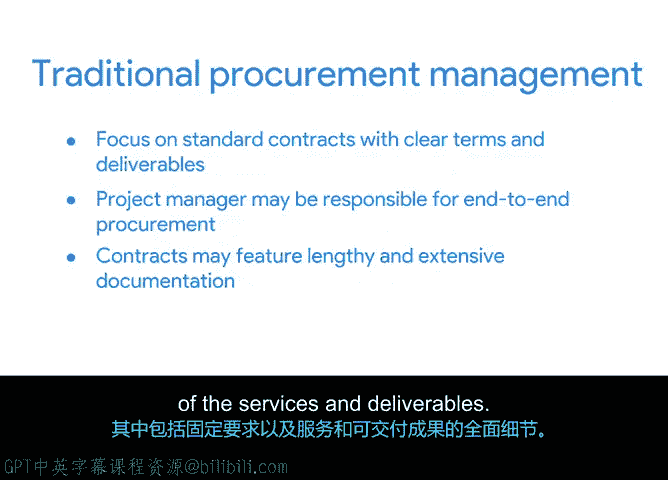

**谷歌项目管理专业证书：第3课：项目规划：将一切整合起来｜P26：采购流程**

在本节中，我们将学习项目采购流程。采购是指从外部供应商获取商品或服务以满足项目需求的过程。并非每个项目都需要采购，但了解其流程至关重要，以便在需要时做好准备。

采购流程通常包含五个步骤。以下是每个步骤的简要说明。

**第一步：启动**
这是规划阶段，旨在确定为实现项目目标，在当前资源之外需要哪些外部帮助。在此步骤中，你还需要为通过采购流程获取额外资源提供理由。

**第二步：选择**
此步骤涉及决定需要哪些物资以及选择哪些供应商。

**第三步：合同编写**
在此阶段，合同被制定、审查并签署。

**第四步：控制**
此阶段涉及付款、安排物流、设定要求以维持质量，并确保服务协议得到履行。

**第五步：完成**
这是最后一步，你需要评估采购的成功与否。

以上是对采购流程的快速概述。随着课程的深入，这个高层级的采购周期将变得更加清晰。

有一点需要注意，采购流程可能因项目管理方法论的不同而有所差异。

敏捷方法与传统方法在采购方面存在区别。敏捷采购管理通常比传统方法更注重项目团队与最终供应商之间的协作，非常强调各方之间的关系。整个项目团队在识别采购需求方面扮演更重要的角色，而不是依赖于基于固定交付成果的合同。

敏捷采购管理倾向于使用“活的合同”，可以根据项目评估进行调整。如果你想到“敏捷”这个词意味着轻松快速地移动，就能记住敏捷采购比传统采购方法更容易变更。在此过程中，团队定期审查项目或交付成果，并持续处理反馈。将这种工作方式传达给你的供应商非常重要，以便他们理解并同意保持灵活性。再次强调，与采购供应商建立积极的关系至关重要，因为在项目期间合同可能需要在多个节点重新谈判。

另一方面，传统采购管理往往侧重于具有明确条款和交付成果的标准合同。在传统方法中，项目经理可能负责端到端的采购，而不是整个团队提供意见。合同可能包含冗长而详尽的文档，详细说明了固定的需求以及服务和交付成果的全面细节。虽然这看起来更僵化，但其好处是你已经勾勒出更清晰的工作流程和截止日期。

这样，你能更好地防范不可预见的情况，并且可能无需为不可预测的变更付费。在传统方法中，谈判过程可能更具挑战性。如果情况发生变化，你不一定有重新谈判合同的空间，因此可能必须重新启动整个流程。这就是为什么在更传统的项目管理方法中，尽可能详细并在谈判阶段花费更多时间极其重要。

正如你可能猜到的，采购可能变得相当复杂。但有一些正式文件可以帮助你指导采购流程。在下一个视频中，你将了解更多关于这些文件和流程的信息。

**本节总结**
本节课我们一起学习了项目采购的基本流程，包括启动、选择、合同编写、控制和完成五个步骤。我们还比较了敏捷与传统项目管理方法在采购上的主要区别：敏捷强调协作与灵活合同，而传统方法则依赖详细、固定的合同条款。理解这些差异有助于你根据项目特点选择合适的采购策略。