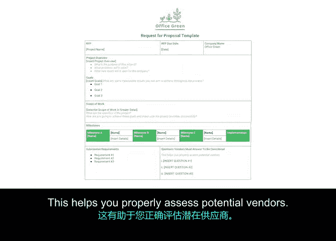

# 027：常见采购文件 📄

在本节中，我们将学习项目管理中采购流程的几个关键文件。这些文件帮助项目经理在不同阶段与外部供应商或承包商进行有效沟通和管理。

上一节我们介绍了采购流程的各个阶段，本节中我们来看看在这些阶段中会用到哪些具体的文件。

## 非披露协议 (NDA)

第一个重要文件是**非披露协议**，通常简称为 **NDA**。NDA 是许多公司的标准做法，要求外部合同工签署。其目的是将组织的机密信息控制在内部。

例如，如果一家公司在项目中使用某种专有技术，或正在筹备敏感的产品发布，他们希望确保有关该技术的任何对话或信息，在公司准备好发布之前不会泄露给竞争对手或公众。

在“植物动力”项目中，供应商可能需要签署 NDA，因为该项目是市场新品，尚未公开。

## 提案请求 (RFP)

接下来是**提案请求**，简称 **RFP**。这是一份概述组织项目细节和要求的文件，将传递给供应商。RFP 用于向供应商征集投标方案，以便您选择最适合您项目的供应商。

RFP 在公司内部不同部门以及各行业中被广泛使用。一份 RFP 通常包括项目概述、期望成果与目标、预算、截止日期、里程碑和联系信息。这样，每个供应商都可以向您反馈他们计划如何完成工作的详细提案。

以下是创建 RFP 时应包含的几个关键部分：

*   **概述**：将此部分视为总体摘要。说明项目目的、将解决的问题以及为公司开启的新机遇。
*   **目标**：列出在整个过程中旨在实现的可衡量成果。
*   **工作范围**：说明项目的具体细节，以及如何实现目标并确保项目成功启动。
*   **里程碑**：务必突出项目将包含的关键里程碑。
*   **提交要求**：例如，要求将 RFP 作为演示文稿提交，并包含三个原型，以及您希望供应商在此过程中回答的问题。

这有助于您正确评估潜在的供应商。例如，您可能想知道承包商预见到哪些问题，或者成本将如何分解。

RFP 发出后，各供应商会进行审阅。如果他们觉得自己能满足您项目的需求，就会提供一份提案。例如，您可以为“植物动力”项目创建一份 RFP 来寻找植物供应商。在这种情况下，您需要向所有可能的植物供应商发送 RFP，以确保获得最佳的价格、质量和整体价值。

请注意，NDA 和 RFP 都是固定的文件，在整个过程中保持不变。这意味着没有太多定制空间，一旦提交就不会更改。

## 工作说明书 (SOW)

最后，还有第三个重要文件，称为**工作说明书**，简称 **SOW**。SOW 是在选定供应商后发送的，并且会随着项目的进展而演变。

我们将在下一个视频中继续讨论这些概念，并进一步探讨工作说明书的重要性。

本节课中我们一起学习了采购流程中的三个核心文件：用于保护机密信息的**非披露协议 (NDA)**、用于征集供应商方案的**提案请求 (RFP)**，以及在选定供应商后定义工作细节的**工作说明书 (SOW)**。理解这些文件的作用和适用阶段，对于有效管理项目采购至关重要。