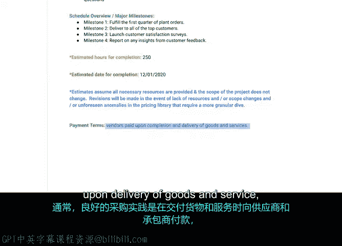

# 028：创建工作说明书 📄

## 概述

在本节中，我们将学习项目成功所需的关键文件之一：**工作说明书**。在向客户发送提案请求并选定供应商后，你需要向他们提供一份SOW。这份文件明确了供应商将为组织提供的产品和服务，是确保各方期望一致的重要工具。

---

## 什么是工作说明书？

工作说明书是一份清晰阐述供应商或承包商将为组织提供的产品和服务的文件。SOW还描述了承包商为正确执行约定服务所需的需求和要求。

虽然SOW涵盖了客户的需求，但同样重要的是包含组织和供应商的需求。为确保交付最佳的产品或服务，所有相关方都必须理解彼此的责任。

项目经理负责制定SOW，但通常会向主题专家征求技术意见，以弥补自身可能缺乏的专业知识。组织的法律顾问将与你一起审查这份文件，甚至可能共同起草。

---

## 如何创建工作说明书：以“绿植计划”项目为例

上一节我们介绍了SOW的基本概念，本节中我们来看看如何具体创建一份SOW。我们将以“绿植计划”项目为例，逐步拆解。

### 1. 页眉与利益相关者

首先，在页眉中包含公司名称、项目名称和创建日期。在页面顶部，确保列出重要的利益相关者，例如作为项目经理的你自己，以及项目发起人（在本例中是产品总监）。

### 2. 修订记录表

SOW很可能会经历几轮修订，因为多位利益相关者会审查并提出修改建议。你需要在此处详细记录这些变更。

### 3. 目的部分

在此部分详细说明项目的期望成果。确保包含关于目标受众的部分，并确保其涵盖所有人。

例如，在本项目中，目的是推出一项为办公室和商业企业提供桌面绿植的新服务。如果有更具体的目标，也可以在此列出。

### 4. 范围部分

此部分包含服务所涵盖的内容。以下是需要明确的内容：

*   **范围内事项**：描述服务具体包含什么。例如，服务包括为客户提供小型、低维护的桌面植物；客户可通过在线或印刷目录订购；供应商将植物运送到客户的工作地址；范围内的植物类型包括6英寸阔叶蕨类、小型仙人掌和5英寸盆景树。
*   **范围外事项**：明确说明项目不包含什么。这可以消除潜在的混淆，并帮助供应商设定正确的期望。例如，项目不包含年度报告或范围中未提及的定制植物订单。

### 5. 可交付成果

你需要一个关于项目将交付什么的简明陈述。例如，“绿植计划”项目的可交付成果可能包括：
*   供应商提供关于如何养护植物的维护指南。
*   供应商负责在“绿植计划”网站上开发一个支持页面，以解答任何问题或疑虑。

### 6. 里程碑

由于里程碑是跟踪进度、预算和范围不可或缺的部分，因此也需要包含在此。以下是“绿植计划”项目的里程碑示例：
*   完成第一季度植物订单。
*   向所有顶级客户交付。
*   启动客户满意度调查。
*   收集并报告来自客户反馈的任何见解。

### 7. 时间与日期

你需要在此明确说明完成项目所需的小时数，并指定需要供应商完成服务的具体日期。

### 8. 条款、条件与免责声明

在底部，通常添加条款、条件和其他免责声明。最好包含一个免责声明，说明随着项目进行可能会进行修订。这很重要，以防因不可预见的问题导致范围变更。

将修订条款写入免责声明是个好主意，因为作为项目经理，最好避免过度承诺而交付不足。你应始终明确表示，除非出现无法控制的情况，否则你打算遵守既定计划。

### 9. 付款条款

SOW的另一部分是付款条款。这概述了何时需要向供应商付款。确保按时付款将促进牢固的合作关系。

通常，良好的采购实践是在交付货物和服务后向供应商和承包商付款，而不是之前，除非已达成特殊情况下的协议。例如，如果“绿植计划”的植物供应商要求在完成每个里程碑时付款，而不是在整个项目结束后付款。

---

## 总结

本节课中，我们一起学习了**工作说明书**的创建。我们了解了SOW的定义、重要性及其核心组成部分，并通过“绿植计划”项目的实例，逐步演练了如何编写一份完整的SOW，包括明确范围、可交付成果、里程碑和付款条款等关键要素。

接下来，我们将讨论在采购过程中与法律团队合作的重要性。