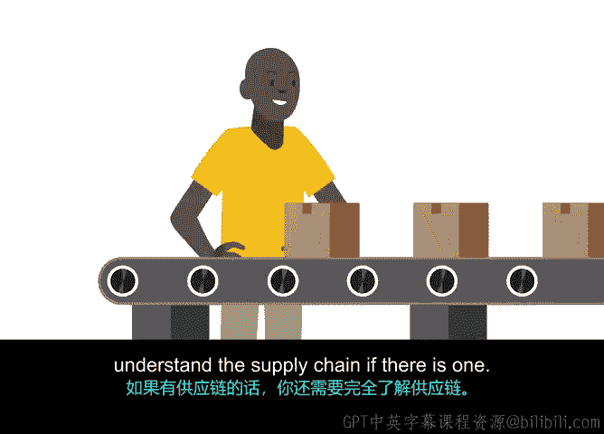

# 030：采购流程中的伦理规范

在本节课程中，我们将探讨与供应商合作时伦理规范的重要性。我们将学习如何识别和规避采购过程中的伦理风险，确保项目从始至终都符合道德标准。

上一节我们介绍了与供应商签订合同的细节，本节中我们来看看在采购流程中坚守伦理的重要性。

在选择供应商时不够审慎，可能导致严重后果。如果你在新闻中看到某家公司卷入丑闻，那通常意味着其团队在采购过程中本应进行更充分的研究。那么，这具体包含哪些工作呢？有许多措施可以确保企业以符合伦理的方式运营。

项目经理在判断项目的每个方面是否都符合伦理采购时，责任重大。项目经理需要全面监督项目，确保安全、经济和环境方面的伦理风险得到缓解。换句话说，在整个项目中进行大量研究、监控和评估是项目经理的职责所在。

以下是保障伦理采购的几个步骤。

首先，了解你所在企业的法律要求。你需要深刻理解作为一名项目经理，法律对你和你的企业有何要求。你也可以查阅你所在职业的伦理准则，在这里指的是项目经理的伦理准则。例如，项目管理协会（PMI）就为其会员或证书持有者提供了一套伦理准则。这将帮助你理解评估采购行为是否符合伦理的一些基本框架。

根据PMI的伦理准则，诚实、责任、尊重和公平是驱动项目管理专业伦理行为的核心价值观。因此，当你成为一名项目经理后，如果对某件事是否符合伦理不完全确定，首先尝试基于你对这些价值观的理解做出最佳判断。如果仍然不确定，务必继续进行研究，并毫不犹豫地向主题专家（例如法务团队的成员）寻求意见。

你可能会遇到的一些不道德问题或风险包括贿赂或腐败。其他国家的某些法规可能与你所在国家的法规不同。例如，你需要确保参与生产的劳动者受到公平对待，在良好的条件下工作，并获得与其劳动相匹配的合理报酬。咨询你的法务团队以确保避免陷入此类困境，并了解与你流程相关的法规，这是一个好主意。

你还需要注意单一供应商采购可能带来的问题。在某些情况下，你可能需要进行非竞争性采购，即公司将投标过程限制在单一供应商。这对于那些更谨慎地保护商业秘密的公司来说可能很常见。但无论出于何种理由，你都需要能够确切地证明为何选择将投标限制在一家供应商。

此外，与国有实体的互动也需要谨慎。在与政府机构和官员打交道时，你需要保持警惕。政府机构在采购方面可能有更严格的法规限制，你肯定不希望在不自知的情况下做出任何不道德的行为。

项目经理需要在全过程中监控项目的伦理合规性。

在启动阶段，你首先需要判断项目本身是否符合伦理。它是否符合你企业的伦理准则？项目是否符合政府机构制定的环境伦理标准？劳动力来源是否符合伦理？在合同签署前，你需要审查政府法规和政策，评估潜在风险，并组建一个你信任的、多元化的、有道德的团队。

在规划阶段，你需要确定你考虑雇佣的供应商是否符合伦理。你需要确保以符合伦理的方式采购他们的服务或产品，并支付公平的价格。如果存在供应链，你还需要完全理解整个供应链。

在执行阶段，合同签署后，务必履行你的保证职责。这可能包括审计每项任务和成本、执行质量控制，甚至在产品或服务生产过程中审批发票。专注于与供应商的日常关系，确保他们了解并满足你的交付成果，并及时告知你任何潜在的障碍。

在完成所有关于项目是否符合伦理的研究后，请记住要相信自己。如果感觉某件事不对劲，那它很可能就是有问题。正如你所知，项目经理需要跟踪的事务很多。通过在项目开始时就将这些伦理原则牢记于心，你将为你自己和公司避免后续的许多麻烦。当然，如果你有任何疑问或需要第二意见，通常可以随时咨询你的法务团队或关键相关方。

在下一视频中，我们将回顾并总结刚刚涵盖的所有内容。我们稍后见。

本节课中，我们一起学习了伦理规范在采购流程中的核心地位。我们明确了项目经理在确保项目伦理合规方面的关键职责，并分阶段（启动、规划、执行）探讨了具体的实践步骤，包括了解法律要求、遵循专业伦理准则（如PMI的四大价值观：**诚实、责任、尊重、公平**）、识别风险（如贿赂、不公平劳工待遇），以及在整个项目周期中进行持续的研究、监控和评估。牢记这些原则，能有效保护项目和公司免受伦理违规带来的重大风险。