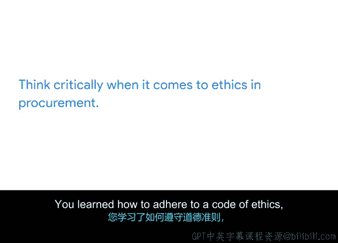

# 031：项目规划整合总结 🎯

在本节课中，我们系统性地学习了项目成本与预算管理、采购与供应商管理，以及相关的伦理考量。这些知识是构建坚实项目计划、确保项目成功交付的核心组成部分。

## 成本与预算管理 💰

上一节我们介绍了项目规划的整体框架，本节中我们来看看项目成本与预算管理的具体内容。

我们学习了项目预算的定义：**项目预算是为实现既定目标和目的所需的预估货币资源**。

我们认识到，项目预算远比单纯“省钱”复杂。它是一个用于追踪项目绩效的成功度量标准。请记住，**项目预算超支或未足额使用都是不可取的**。

我们还学习了成本控制，它涉及多个利益相关者的审批以及对变更的积极管理。

## 采购与供应商管理 📦

在深入理解预算之后，项目执行通常需要外部资源，这就引出了采购管理。

我们深入探讨了采购与供应商管理，这涉及为项目成功获取必要的物资、材料和外部资源。

以下是采购管理的重要步骤：
*   **启动**：确定采购需求。
*   **选择**：评估并选择供应商。
*   **合同撰写**：明确条款与条件。
*   **控制**：管理供应商绩效与合同履行。
*   **完成**：结束采购活动。

我们现在知道，采购方式会因所使用的项目管理方法论而异。

**敏捷采购方法**不同于**传统采购方法**。敏捷采购更基于关系，因为谈判在整个项目期间持续开放。它需要与供应商进行更频繁的沟通，因为合同可能会定期审查和调整。

传统采购方法通常在采购阶段完成并结束。

我们学习了保密协议（NDA）、建议邀请书（RFP）和工作说明书（SOW），并一起创建了一份SOW。

## 采购中的伦理思考 ⚖️

最后，你学习了一些在采购中如何进行批判性伦理思考的方法。

你学习了如何遵守道德规范、何时运用自己的判断力，以及研究采购伦理的重要性。

做得好。

## 总结与展望 🚀

本节课中，我们一起学习了项目成本预算的核心概念、采购管理的完整流程与不同方法论下的实践差异，以及采购活动中必须坚守的伦理原则。

接下来，你将学习不同类型的风险、如何识别风险以及如何缓解风险。我们下节课见。