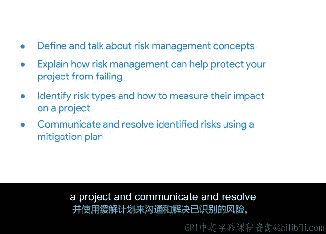

**谷歌项目管理专业证书：第3课：项目规划：将一切整合起来**

**P32：32_04_01_引言：有效管理风险**

**概述**

在本节课程中，我们将学习项目风险管理。我们将探讨风险管理的概念、重要性，以及如何通过识别、评估和应对风险来保护项目免受失败。

**课程内容**

欢迎回来。在上一节中，我们介绍了项目成本与预算管理，讨论了项目预算的构成、预算流程的运作方式，以及如何跟踪和估算预算。同时，你也学习了采购流程。

本节中，我们将讨论风险管理，以及它为何对预防项目失败至关重要。了解如何预见和缓解（通常称为“减轻”）潜在问题，是确保项目按计划进行的最佳保障。

你将学习如何定义和理解风险管理的相关概念，并解释风险管理如何帮助保护你的项目免于失败。你还将识别风险类型，学习如何衡量它们对项目的影响，以及如何使用缓解计划来沟通和解决已识别的风险。

准备好开始了吗？很好，我们将在下一个视频中继续学习。