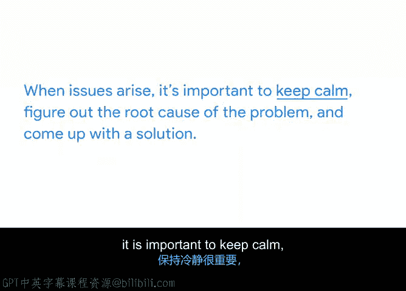

# 033：风险管理的重要性 🛡️

在本节课中，我们将要学习项目风险管理的基础知识。你将了解什么是风险、风险与问题的区别，以及为什么主动进行风险管理对项目的成功至关重要。

---

回想一下你生活中管理一个项目的经历。可能是一个专业项目，比如制定员工排班表；也可能是一个个人项目，比如策划一场家庭庆祝活动。现在问自己一个问题：一切是否都按计划进行？我猜，你至少需要处理一个意外障碍。

这是因为没有任何项目能100%按计划进行，即使是由经验最丰富的项目经理来执行也不例外。也许你完美地制定了员工排班表，但有人突然感冒，迫使你在最后一刻重新安排。或者，就在家人开始抵达庆祝活动时，你发现自己忘了买冰块来冰镇饮料。这些事情时有发生。正如我们之前所说，灵活性是管理项目的一项重要技能。

鉴于项目乃至生活的本质，识别并规划可能影响项目的风险同样至关重要。

## 什么是风险？🤔

上一节我们提到了项目中的不确定性，本节中我们来看看如何定义和区分这些不确定性。

**风险**是指可能发生并可能影响项目的潜在事件。在项目管理语境中思考风险时，应将其视为**假设性**的。换句话说，这些事件不一定会发生，但因为存在发生的可能性，作为项目经理，你有责任识别并规划应对这些风险。

接下来，我们来讨论**问题**。**问题**是已知的或真实存在的、可能影响任务完成能力的情况。

那么，风险和问题有什么区别呢？可以这样理解：**风险**是可能发生的事件。**如果该事件实际发生了，那么风险就变成了问题**。换言之，风险是“如果……会怎样”的大问题，而问题是当前正在影响项目的事情。

显然，风险和问题都对项目构成威胁。而管理这些风险的过程，就称为**风险管理**。

## 理解风险管理 🔄

既然我们已经区分了风险与问题，现在让我们深入了解风险管理的核心概念。

**风险管理**是识别和评估可能影响项目的潜在风险与问题的过程。这不是一次性的活动，而是你需要定期进行以应对潜在风险的工作。

风险管理是规划过程中的关键部分。它让你了解项目可能出什么问题，告诉你需要就风险咨询谁，并帮助你确定如何**减轻**潜在风险的影响。这样，如果或当出现问题，你就能有一个准备好的计划来应对。

以下是风险管理带来的主要好处：
*   **主动规划**：识别潜在风险及其解决方案，是主动性和前瞻性规划的一部分。
*   **提高成功率**：通过这种方式，你能为项目设定更好的成功机会。

## 忽视风险管理的后果 ⚠️

未能进行有效的风险管理可能会给你的项目带来几个严重的后果。

首先，如果不提前规划，你的项目可能面临无法达成项目目标、时间表或成功标准的风险。例如，如果你的目标是发布一份研究报告，而你的研究分析师在项目中途辞职，如果你没有准备好备用计划，你很可能会错过截止日期。

此外，未能规划风险，也意味着你未能思考项目在遇到问题时可以如何调整方向并仍能达成目标的多种不同方式。即使出现问题，达成项目目标的方法通常也不止一种，成功可以以多种形式呈现。风险管理帮助你确定计划的灵活性或刚性程度，从而做出必要的调整。

例如，如果你的项目需要一次大型产品运输，准备好一个备用供应商意味着当你的主要供应商无法履行订单时，你可以迅速调整方向。

最后，风险会以各种难以预见的方式影响项目。例如，你雇佣的供应商可能没有足够的库存来满足你的采购需求，或者你的项目预算可能被意外削减。风险管理过程有助于减少意外事件的影响，从而释放资源，专注于对项目有益的活动。

## 风险管理实例：Office Green项目 🌵

为了更具体地理解，让我们在Office Green项目的背景下设想风险管理。Office Green是一项新服务，旨在为客户提供小型、低维护的桌面植物。

以下是该项目可能面临的一些潜在风险：
*   **网站延迟上线**：新服务的网页可能无法在发布时准时上线。
*   **供应短缺**：如果植物供应商的仙人掌蕨类植物库存不足，你该怎么办？

为了应对这些潜在风险，你需要思考在问题发生前如何减轻其影响，或者在实际发生时如何解决它们。希望这些问题不会出现，但如果出现，你将有所准备。

## 总结与展望 📝

本节课中，我们一起学习了风险管理的基础知识。我们明确了**风险**（潜在事件）与**问题**（已发生事件）的区别，理解了**风险管理**是持续识别、评估和规划应对潜在威胁的过程。有效的风险管理能提高项目成功率，而忽视它则可能导致目标无法达成。

我还想强调，在整个项目中，总会出现一些你**没有或无法**提前计划到的问题。这很正常。当这些时刻来临时，重要的是保持冷静，找出问题的根本原因，并提出解决方案。

风险管理是项目经理需要理解的一个非常重要的主题。识别风险和问题能让你为未知做好准备。它也会对你作为项目经理产生积极影响，因为如果出现问题，你会感觉准备更充分、压力更小，并且对自己的处理方法更有信心。

接下来，我们将讨论识别风险的具体方法。我们下节课见。