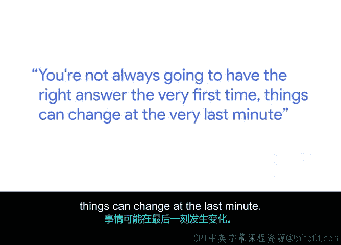

**谷歌项目管理专业证书：第3课：项目规划：将一切整合起来**

**概述**

在本节课中，我们将通过YouTube项目经理斯坦顿的亲身经历，学习如何管理你的第一个项目。我们将探讨项目初期常见的挑战、应对变化的策略，以及保持冷静和专业的重要性。

---

**P34：34_04_03 斯坦顿：管理我的第一个项目** 🎯

大家好，我是斯坦顿，是YouTube的一名项目经理。

回想我最初负责的项目之一，是负责构建一个体育集锦应用。这不仅仅是一个应用，它包含iOS应用、Android应用和一个网站。

我记得我参加的第一次会议，我只是在疯狂地记笔记，试图理解到底发生了什么。会议结束后我立刻想，这是我的第一个项目，我必须把所有细节都做对。

我必须确保我们知道将要发生的每一件小事。发布日期必须完美，我们必须把所有漏洞都修复到零。我当时完全被“第一次就要把所有事情都做对”的想法占据了。

从那以后我意识到，你的第一个项目计划很可能不会完全正确，因为有太多事情可能发生变化。你可能在发布前的最后一刻发现一个漏洞；你的客户可能会过来说他们想要不同的需求，比如屏幕需要是蓝色而不是红色；然后你发现从蓝色改成红色并不那么容易。

如果我能回到过去告诉当时的自己该怎么做，或者我可以有哪些不同的做法，我会告诉自己：别太担心。变化总会发生，更重要的是你如何应对和回应这些变化。

我得到过的最好的赞美之一是：即使经历了所有这些混乱，你依然冷静、镇定、有条不紊。你会思考出现了哪些问题，以及我们如何解决它们。你做着你项目管理该做的事。

你不可能第一次就总是有正确的答案，事情可能在最后一刻发生变化。如果你能保持冷静和镇定，确保你理解项目中正在发生的所有其他事情，那么这些年来的经验告诉我，你总可以复用一些东西。

你总是需要对一些事情做出反应，但无论如何，试着主动思考，试着找出那些可能的问题，你会因此做得更好。

---

**总结**

本节课中，我们一起学习了斯坦顿管理第一个项目的经验。核心要点在于：接受项目计划不会一开始就完美，变化是常态。关键在于保持冷静（`保持冷静`），主动思考问题（`主动思考`），并灵活应对变化。项目管理的能力体现在应对变化的过程中，而非追求一个绝对完美的初始计划。