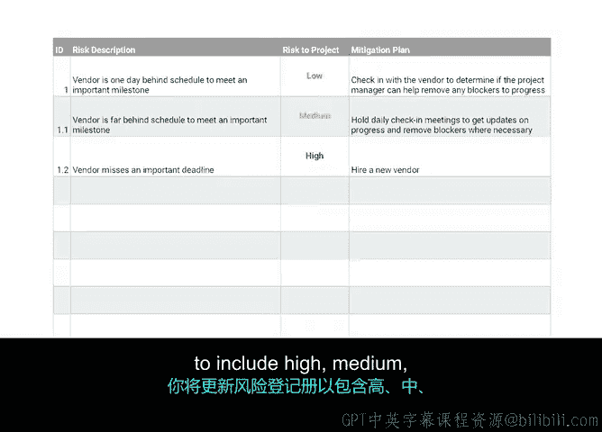

# 035：辅助识别风险的工具 🛠️

在本节课中，我们将学习如何识别和评估项目风险。有效的风险管理始于对潜在问题的系统化识别。我们将介绍两种核心工具：头脑风暴与风险矩阵，并学习如何将它们整合到风险登记册中。

## 识别风险：头脑风暴

上一节我们介绍了风险管理的重要性，本节中我们来看看识别风险的具体工具。头脑风暴是与团队一起识别风险的最有效技巧之一，因为它允许团队自发地分享想法，而不受评判。

作为项目经理，你将负责召集一组人员来设想潜在风险。在决定邀请谁参加会议时，请准备好你的RACI图表以供参考。根据经验，执行此任务的最佳团队是多元化的团队，其中包括来自不同角色、背景和经验的成员。多元化的团队带来不同的视角、经验和技能组合，这有助于识别你可能独自无法想到的风险。

例如，你的团队中可能有一位成员拥有多个项目的工作经验，而另一位较新的团队成员则可能从他们在其他团队中的先前经验带来全新的视角。

以下是可用于头脑风暴的一个强大工具：

*   **因果图**：也称为鱼骨图。因果图显示事件或风险的可能原因，在风险管理中非常有用。例如，图中列出的“效果”是供应商错过截止日期。这是一个项目风险。在左侧，你可以头脑风暴出导致此效果的原因，例如授权不当或缺乏跟踪工具。换句话说，因果图通过识别一个潜在风险（称为“效果”），然后反向思考该风险的潜在原因，来帮助识别所有可能出错的方式。通过分类并将其分解为更具体的原因，你能够识别可能导致潜在问题的领域。

需要提醒的是，范围蔓延指的是项目开始后任何时间点影响项目范围的变更、增长和不受控制的因素。在这些头脑风暴会议中，你可能会发现潜在风险列表很长，这没关系。这是现实情况。你和你的团队无法考虑到项目中可能发生的每一个问题。

## 评估风险：概率与影响矩阵

既然我们已经识别了潜在风险，那么如何决定关注哪些风险呢？首先，将头脑风暴的结果列在风险登记册中。风险登记册是包含风险列表的表格或图表。

接下来，你将采用一种风险评估技术。风险评估是风险管理的阶段，在此阶段对风险的性质进行估计或衡量。这里所说的性质，主要指风险发生的可能性及其对项目的潜在影响。

评估风险有几种方法，但我们将重点介绍创建概率与影响矩阵。概率与影响矩阵是一种用于对项目风险进行优先排序的工具。之前提到，你需要评估风险发生的可能性及其潜在影响。这个矩阵将帮助你做到这一点。

要创建概率与影响矩阵，你需要考虑**影响级别**和**概率级别**。

*   **影响**：指风险发生可能造成的损害。影响也按高、中、低等级别确定。**高**意味着如果风险发生，将实质性改变项目。**低**意味着如果风险发生，影响轻微，不太可能使项目脱轨。
*   **概率**：指风险发生的可能性。概率也按高、中、低等级别确定。**高概率**意味着此事发生的可能性很高。**低概率**意味着你识别了一个可能发生的风险，但该风险实际发生的可能性不大。

这两个考虑因素共同决定了**固有风险评级**。固有风险是通过其概率和影响计算出的风险度量。衡量固有风险为我们提供了一种理解风险的方法。固有风险也按高、中、低等级别确定。

因此，基本上，如果一个风险具有**低影响**和**低概率**，则其固有风险评级为**低**。这些是你无需过分担心的风险类型。但如果一个风险具有**高影响**和**高概率**，则其固有风险评级为**高**。中到高风险是你应该重点关注并为之制定详细缓解计划的风险。

创建概率与影响矩阵时，重要的是确保创建的矩阵符合无障碍访问指南，并且信息和格式易于所有人快速理解。实现这一点的一种方法是同时使用颜色和独特的形状或文本来传达风险级别。

## 风险偏好与登记册更新

你查看和管理每个风险的方式将基于你所在组织的**风险偏好**来确定。风险偏好指的是组织接受风险可能结果的意愿。你、你的团队和你的利益相关者可能对每个风险有不同的偏好。

某些可能导致轻微挫折的低级别风险，比可能完全破坏项目的高级风险要容易接受得多。完成风险评估后，你将更新风险登记册，为你为此项目识别的风险示例包含高、中、低评级。

## 总结

本节课中，我们一起学习了识别和评估项目风险的关键工具与技术。我们介绍了如何使用头脑风暴和因果图来全面识别潜在风险，以及如何运用概率与影响矩阵对风险进行优先级排序。我们还了解了风险偏好如何影响风险管理决策，并明确了将评估结果记录在风险登记册中的重要性。掌握这些工具将帮助你在项目规划阶段更好地预见和准备应对潜在挑战。