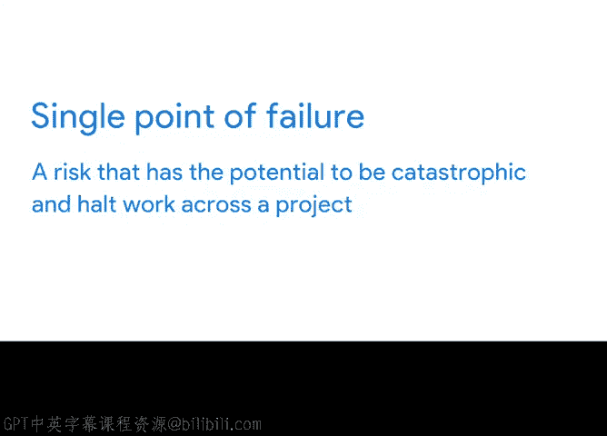
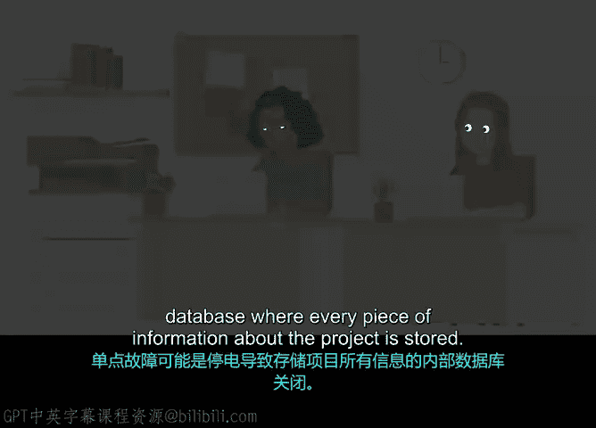
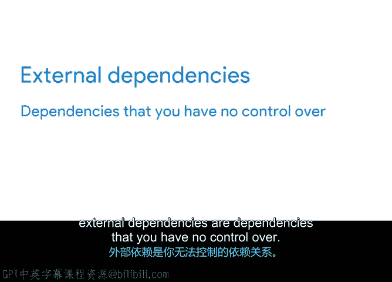

# 036：风险类型 🎯

在本节课程中，我们将学习项目管理中常见的风险类型。了解这些风险有助于我们提前规划，确保项目顺利进行。

## 概述

项目在执行过程中总会遇到各种不确定性，这些不确定性就是风险。本节我们将重点介绍几种常见的风险类型，包括时间风险、预算风险和范围风险，并探讨如何识别和管理它们。

## 常见风险类型

虽然可能影响项目的风险种类繁多，但你需要重点关注的主要是时间风险、预算风险和范围风险。

以下是这三种核心风险的详细说明：

*   **时间风险**
    *   **定义**：指项目任务实际完成时间可能超过预期的可能性。
    *   **重要性**：你需要关注时间风险，因为时间就是金钱。糟糕的时间管理可能会耗尽你的预算，并因项目延误而让利益相关者感到不满。

*   **预算风险**
    *   **定义**：指由于规划不当或项目范围扩大，导致项目成本增加的可能性。
    *   **重要性**：你需要关注预算风险，因为预算是控制项目成本的基础。例如，如果超支，你可能无法支付供应商款项，这也可能对公司声誉造成损害。

*   **范围风险**
    *   **定义**：指项目可能无法产出项目目标中概述的成果的可能性。
    *   **重要性**：你需要关注范围风险，因为项目的交付成果可能无法被利益相关者或客户接受，这可能会使整个项目的目标落空。

## 外部风险与单点故障

上一节我们介绍了三种常见的内部风险，本节中我们来看看来自项目外部的风险以及其他需要警惕的风险源。

时间、预算和范围风险非常常见，但你还需要注意其他类型的外部风险。外部风险指的是由公司外部因素导致、你几乎无法控制的风险。例如，你的项目可能受到环境风险（如大风暴）或法律风险（如法规要求变更）的影响。

同样重要的是，要知道风险的类型是无穷无尽的。永远不会有识别和管理每一种可能风险的固定处方，但如果你有一个计划，就能更好地应对任何可能出现的情况。

现在，我们来讨论一种特定的风险类型，称为**单点故障**。

*   **定义**：单点故障是一种可能造成灾难性后果、导致整个项目工作停滞的风险。
*   **影响**：这类风险有能力让整个团队的工作陷入停顿，意味着在问题解决之前，没有人能推进他们的任务。
*   **示例**：在我们的办公室绿化场景中，一个单点故障可能是停电导致存储所有项目信息的内部数据库宕机。在数据库恢复运行之前，你的团队将无法访问他们工作所需的任何信息，从而无法完成任何分配的任务。
*   **缓解措施**：为了缓解这种风险，你可以在预算中规划一个独立的云服务，作为所有项目文档和信息的备份。
*   **管理职责**：作为项目经理，你需要识别并监控项目中潜在的单点故障，因为它们可能对项目的时间线、预算和范围造成损害。

## 依赖关系风险

另一个需要警惕的风险来源是依赖关系。

*   **定义**：依赖关系是两个项目任务之间的关系，其中一个任务的开始或完成取决于另一个任务的开始或完成。换句话说，依赖关系就像连接一个项目任务与另一个任务的链接。在任务完成或另一个任务开始之前，必须处理好依赖关系。
*   **风险来源**：因为依赖关系是连接项目任务的链接，所以它们通常是项目风险的重要来源。
*   **示例**：假设你指派一位队友负责聘请本地植物供应商。在他们与供应商签订合同之前，你的团队无法下任何订单。这就是一个依赖关系。风险在于：如果你的队友没有在截止日期前完成聘请工作，然后休假一周，这可能会延误你的项目时间线。
*   **后果**：如果你不为依赖关系做计划，可能会面临预算、进度或项目成果受到影响的风险。
*   **预防措施**：为了防止此类情况发生，你可以在项目开始时要求队友与你分享他们的休假计划。这有助于你了解每个人的日程安排，确保有备用计划来维持项目进度。

依赖关系主要分为两种类型：

*   **内部依赖关系**：指项目内部、你和你的团队可以控制的依赖关系。例如，在开始开发之前，你需要获得网站设计的批准。
*   **外部依赖关系**：指你无法控制的依赖关系。例如，你的植物供应商所在的农场今年可能经历了较少的雨季，这意味着他们可供销售的植物数量会减少。

## 总结

本节课中我们一起学习了项目管理中的主要风险类型。从时间风险、预算风险到范围风险，再到外部风险和单点故障，以及依赖关系带来的风险，我们了解到没有项目是无风险的。但通过仔细的前期规划，我们可以尽最大努力防止风险发生。在下一个视频中，我们将讨论如何缓解风险。