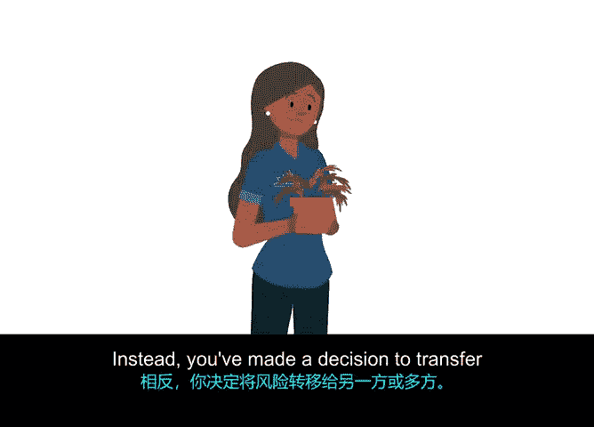

# 037：将一切整合起来

## P37：风险缓解策略 🛡️

欢迎回来。你已经学习了如何识别项目风险，并使用概率与影响矩阵对它们进行评估。

既然你知道了哪些风险需要关注，那么如何决定如何处理它们呢？这就是风险缓解规划的作用所在。风险缓解规划旨在寻找方法，以消除或减少潜在风险对项目的影响。

有四种常见的风险缓解方式：**规避**、**接受**、**降低/控制**和**转移**。我们将使用“办公室绿化”项目的例子来逐一讨论这些选项。

以下是四种主要的风险缓解策略：

*   **规避风险**：有时你可以完全避免风险。例如，如果你了解到为办公室绿化项目考虑合作的某个承包商有声誉不佳、经常延误工期，那么你可以通过雇佣不同的承包商来规避这个风险。
*   **接受风险**：你可以接受风险，尤其是那些你认为发生概率和影响都较低的风险。在这种情况下，你接受了风险可能发生的可能性，同意在整个项目中监控它，并且即使风险真的发生，你最终也能接受。例如，你的植物供应商告知你，你订购的一种花盆款式缺货了。供应商有信心在不延误你项目进度的情况下补货。但如果他们的补货运送出现问题，可能会导致向客户交货延迟最多两天。与其重新寻找新供应商，你认为接受这个风险更合理。虽然发生延迟并不理想，但你有灵活性，并且知道接受这个风险可以避免你和团队花费两周时间去接洽新供应商带来的麻烦。
*   **降低或控制风险**：另一种缓解风险的方法是降低或控制它。我个人喜欢在制定缓解计划时使用决策树。**决策树**是一种流程图，有助于可视化某个决策对你项目其余部分的更广泛影响。例如，你决定雇佣那个有延误工期声誉的承包商，因为你知道他们工作质量很好。在这种情况下，你可以创建一个简单的流程图，来可视化风险以及应对的潜在选项，比如通过电子邮件或会议每天与承包商核对进度。最终，你可能会选择与团队进行每日进度会议，以确保他们能跟上任务进度。
*   **转移风险**：最后，你可以选择转移风险。例如，你已确定在Office Green公司现场种植植物风险太高，因为恶劣天气或害虫可能对产品产生负面影响。相反，你决定将风险转移给另一方或多方。通过将植物生产外包给本地供应商，如果出现质量问题，你就有权更换供应商。当你转移风险时，你就不必冒损失时间、资源和金钱的风险。

所以，总结一下，四种常见的风险缓解方式是：**规避**、**接受**、**降低/控制**和**转移**。使用这四种策略之一，可以帮助你有效地掌控项目风险。

接下来，我们将讨论如何在风险管理计划中记录这些风险。

