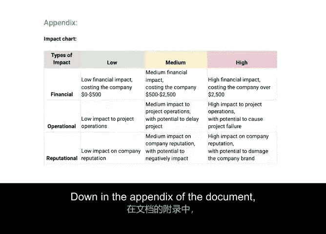
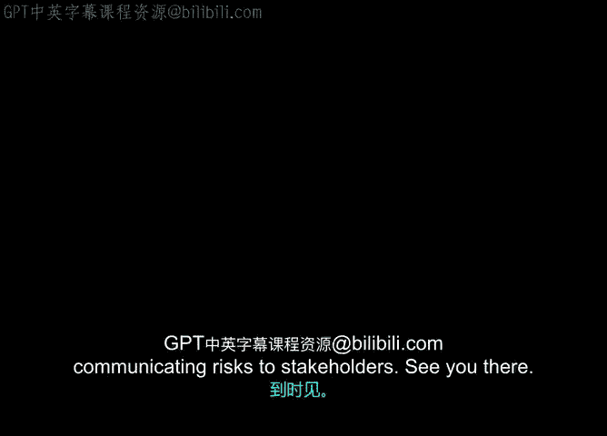

**谷歌项目管理专业证书：第3课：项目规划：将一切整合起来**

**P38：38_04_02：制定风险管理计划**

---

### **概述**

在本节中，我们将学习如何将风险应对决策正式记录成文，即制定一份**风险管理计划**。这份计划是项目管理中的关键文档，用于系统化地识别、评估和应对项目风险。

---

### **风险管理计划的重要性**

上一节我们探讨了缓解潜在风险的策略。本节中，我们来看看如何将这些决策记录下来。

作为项目经理，文档记录是您职责的核心部分。在识别风险并制定缓解计划时，这一点尤为重要。

一份**风险管理计划**是一份动态文档，它包含了高层次风险的信息以及针对每个风险的缓解计划。这份计划有助于确保团队成员和利益相关者对潜在问题以及问题发生时的应对方案有清晰的理解。

风险管理是您在项目规划与执行过程中持续参与的实践。由于风险管理贯穿项目始终，该计划应定期更新，以添加新识别的风险、移除不再相关的风险，并包含缓解计划的任何变更。

---

### **风险管理计划模板解析**

以下是风险管理计划的一个示例，类似于谷歌内部有时使用的模板。让我们逐一解析其组成部分。

**文档标题与元信息**
在文档顶部，我们包含公司名称和项目名称。我们还注明文档作者，以便审阅者如有疑问能明确知道联系谁。此模板还指定了文档状态栏位。在制定计划时，您可以将状态列为“进行中”。计划完成后，可更改为“终版”。我们还包含了有用的细节，如文档创建日期和最后更新日期。这些细节看似微小，但包含它们是最佳实践，因为日期的透明度能让利益相关者了解文档的时效性。

**文档目标与执行摘要**
在这些细节下方，是文档目标部分。例如，我们的目标是“概述项目‘Plant P’的缓解计划”。目标下方，我们添加了项目的执行摘要。执行摘要应简要介绍项目的正常情况，并概述可能影响项目的潜在风险。

**核心：风险与缓解措施**
现在进入真正重要的部分：风险以及我们将如何缓解它们。此文档还包含您之前学到的**风险登记册**——一个列出所有可能风险的表格或图表。

以下是一个风险条目的示例：

| 风险描述 | 固有风险评级 | 缓解计划 |
| :--- | :--- | :--- |
| 供应商可能延误截止日期 | 中等 | 与供应商举行每日会议，以帮助他们保持任务进度 |

*   **固有风险评级**：这是根据风险的概率和影响计算得出的风险度量值。
*   **缓解计划**：为应对该风险而制定的具体行动方案。

**附录：评估工具**
在文档的附录部分，您可以找到用于评估风险的概率和影响图表，以及**概率与影响矩阵**。

---

### **计划的分享与沟通**

填写完风险管理计划后，您需要与团队和利益相关者分享，以获取他们的意见，并确保他们与您的计划保持一致。

接下来，我们将更深入地探讨如何向利益相关者沟通风险。

---

### **总结**

本节课中，我们一起学习了如何创建一份结构化的**风险管理计划**。我们了解了计划的核心组成部分，包括文档信息、目标、风险登记册（包含风险描述、评级和缓解计划）以及评估工具附录。请记住，这是一份需要定期更新的动态文档，有效的风险管理依赖于持续的风险识别、评估和沟通。