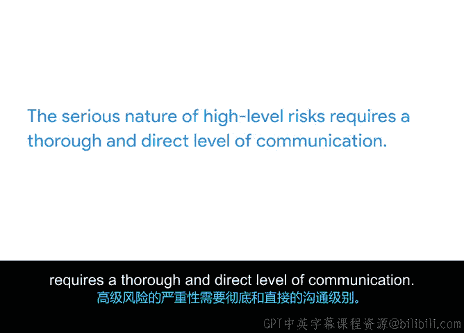

# 039：向利益相关者沟通风险 📢

在本节课中，我们将学习如何在项目规划阶段，向利益相关者有效地沟通已识别的风险。了解如何根据风险的严重程度，选择合适的沟通方式，对于建立信任和确保项目成功至关重要。

---

在之前的视频中我们了解到，识别和评估风险是项目规划过程的关键部分。这些工作能帮助你和团队明确最重要的风险，并确保大家对需要规划应对的风险达成共识。

然而，仅仅你和团队成员意识到项目的最大风险是不够的。你还需要将这些风险传达给你的项目利益相关者。无论是通过文档、电子邮件、会议还是其他你认为合适的形式，利益相关者都需要了解项目面临的风险。

如果你不告知利益相关者重要的风险，那么当问题真正出现时，他们可能无法充分帮助你。例如，当你需要更多预算或资源时，他们可能无法及时提供。更糟糕的是，利益相关者可能会被突发问题搞得措手不及。这类不愉快的意外会削弱他们对你作为项目领导者的信任。他们很可能会想知道你是否预见到了这种风险发生的可能性，并可能质疑你为何没有更早地分享这些信息。

因此，尽早并经常就中高级别风险与利益相关者沟通非常重要。这能为利益相关者设定对项目执行阶段可能发生情况的预期，并表明你已经采取措施来缓解和规划这些风险。同时，这也为你提供了机会，可以在风险发生时建议他们如何提供帮助。

那么，在规划阶段，你应如何向利益相关者沟通风险呢？这取决于已识别风险的严重程度。

以下是针对不同级别风险的沟通方式建议：

*   **低级别风险**：一封简单的电子邮件可能就足够了。例如，在向项目利益相关者发送每周规划更新时，你可以列出一些与其利益相关的低级别风险，并简要说明如果这些风险发生你将如何应对。
*   **中级别风险**：你可能需要提高沟通级别，例如直接向利益相关者发送电子邮件。在邮件中，你需要更具体地概述风险，并提供缓解风险的详细计划。你还可以附上风险管理计划的链接以提供更多信息，并可能在主题行中注明“紧急”以强调邮件的重要性。
*   **高级别风险**：其严重性要求更彻底和直接的沟通方式。在与利益相关者开会讨论项目计划时，你可以在议程中添加一项，专门介绍重大风险以及你的缓解计划。你还可以利用这个机会收集对风险管理计划的反馈，并征求利益相关者对于处理这些高级别风险的建议。他们可能拥有规划类似风险的经验，或能提供你未曾考虑过的策略。

风险沟通是我在谷歌担任项目经理职责的重要组成部分。我经常撰写电子邮件并做项目状态演示，其目标通常是分享已知风险及我的风险缓解计划。在与利益相关者讨论这些计划时，我们常常会发现其他我甚至未曾考虑到的风险。

例如，在最近的一次会议中，我向另一个团队的利益相关者展示一个潜在的新产品。会上，该利益相关者提出了他们的担忧，认为我的解决方案可能会产生时间和资源风险，从而对其团队产生负面影响。这次讨论让我更深入地了解了同事面临的潜在风险以及产品用户的需求，使我意识到我需要向项目发起人申请额外的预算和资源。

因此，与你的利益相关者讨论计划总是一个好主意。他们可能会提供不同的视角。

总而言之，向利益相关者沟通风险非常重要，这样他们才能在需要时更好地帮助你。同时，你应该根据风险的严重程度来调整你的沟通方式。

接下来，我们将回顾并总结我们所学到的所有内容。