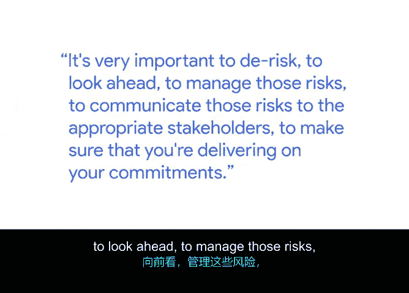
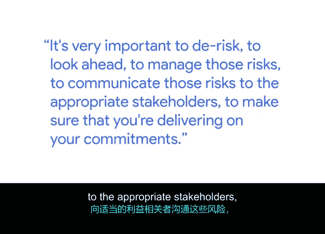
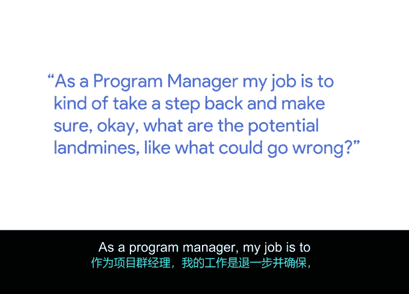
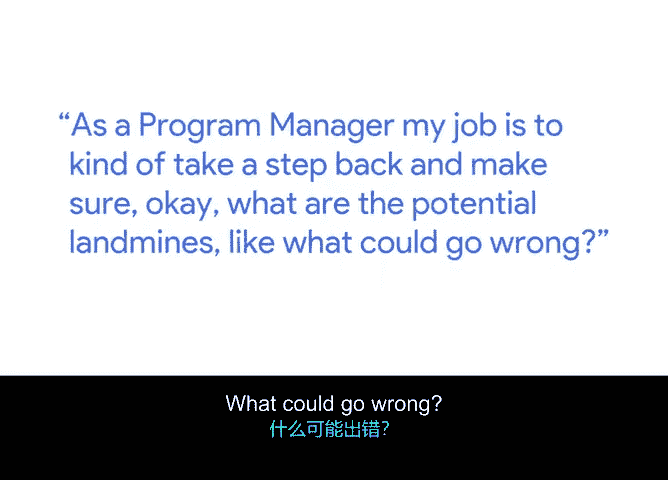

# 040：将一切整合起来 🧩

## 概述
在本节课中，我们将学习谷歌项目经理阿吉分享的风险管理实践经验。我们将了解如何识别、评估和应对项目中的潜在风险，确保项目成功交付。

---

我的名字是阿吉，我是谷歌的高级项目经理。

项目管理横跨许多不同的行业和应用领域。其核心在于，我们为混乱带来秩序。在谷歌，我的工作是负责产品发布，并为团队开发新的流程和程序。

我跨不同的职能领域工作，这些领域可能是工程、用户体验，甚至可能是人力资源。我的目标是帮助发布产品。对我来说，风险管理意味着向前看并尝试预见问题。

我将其比作一个类比：就像在船上，有人负责向前看以确保没有礁石。根据我的经验，我们的大部分项目都不是孤立完成的。总会存在其他依赖关系，有其他团队依赖你去执行。

这些依赖关系非常重要，需要去风险化，需要前瞻性地管理和沟通这些风险，并传达给适当的利益相关者。

---

## 风险管理的核心步骤 🛡️

上一节我们了解了风险管理的定义和重要性，本节中我们来看看实施风险管理的具体步骤。

第一步是识别问题，并引入合适的人员，以确保你拥有一份全面、良好的风险清单。

然后，在此基础上，尝试找出管理这些问题的方法。这应该是一个高度协作的过程，因为团队中的每个人都应同样致力于确保项目成功执行。

---

## 实践案例：从设计到风险的洞察 🔍

在理解了基本步骤后，我们通过一个真实案例来看看风险识别是如何在具体项目中发生的。

我目前正在处理一个项目。在这个项目中，当我们从产品战略角度确定了策略和最终状态后，下一步是创建我们称之为“UX模型”或“UX设计”的东西。这基本上就是我们期望最终状态的图像，即以视觉格式呈现的理想状态。

作为项目经理，我的职责是退后一步，确保思考潜在的风险点，即哪些地方可能出错。

当我开始审阅这些设计图时，我意识到在我脑海中，很难调和并说：“好，这是我们今天做的，这是将要改变的。”这对我来说不是很清晰。

我本人不那么擅长视觉思维，更喜欢电子表格和细节性的东西。因此，我当时想：“如果我都有这个问题，试图在视觉设计和当前状态之间进行调和，那么可能其他人也有同样的问题。”

如果其他人也有这个问题，也许我们的工程师也有这个问题。于是，当我组织会议时，在五分钟内，我们就开始意识到，大家对我们应该做什么的解释存在差异。

如果我们沿着这条路走下去，这两个团队将以不同的方式执行任务，我们可能直到最后才会意识到问题，那时就为时已晚了。

---

## 项目经理的角色与价值 💡

基于上述案例，我们可以总结出项目经理在风险管理中的关键作用。

我热爱项目管理。我喜欢面对一个模糊不清、未经深思熟虑的问题，这是一个巨大的痛点，然后为这个问题提出解决方案。

---

## 总结
本节课中，我们一起学习了谷歌项目经理阿吉的风险管理方法。核心要点包括：**风险管理是前瞻性地识别和应对潜在问题**；其过程始于**全面识别风险**并**引入关键人员协作**；通过一个具体案例，我们看到了如何从设计差异中敏锐地发现执行风险，从而避免项目后期出现重大问题。项目经理的核心价值在于**为模糊的问题带来清晰的秩序和解决方案**。