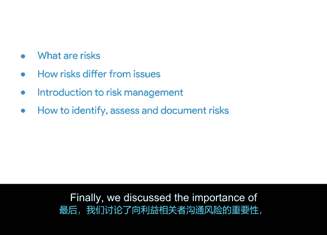

# 041：将一切整合起来

## 概述

在本节课中，我们将回顾并总结项目风险管理的关键概念与工具。我们将明确风险与问题的区别，并梳理识别、评估、记录及沟通风险的全过程。

## 风险管理核心概念回顾

上一节我们介绍了风险识别工具，本节中我们来系统回顾风险管理的核心要素。

### 风险与问题的定义

风险是指可能影响项目的潜在事件。其核心在于“可能性”。

问题是指已知的、真实存在的、可能影响完成特定任务能力的问题。其核心在于“现实性”。

### 风险管理流程

风险管理是识别可能影响项目的潜在风险与问题，并评估和应用步骤以应对其影响的过程。其核心公式可概括为：

**风险管理 = 风险识别 + 风险评估 + 风险应对**

以下是风险管理中涉及的关键工具与方法：

*   **头脑风暴**：一种用于识别风险的技术。
*   **概率与影响矩阵**：一种用于评估风险的工具。通过分析风险发生的**概率**和造成的**影响**，对风险进行优先级排序。
*   **风险登记册**：一份用于记录所有已识别风险及其详细信息的文档。
*   **风险管理计划**：一份描述如何在整个项目周期中规划和管理风险的正式文档。

### 风险沟通的重要性

最后，我们讨论了向相关方沟通风险的重要性。这有助于设定预期，并展示你为规划和减轻项目潜在问题所做的工作。

## 总结

本节课中，我们一起学习了项目风险管理的基础知识。我们明确了风险与问题的区别，介绍了风险管理的完整流程，并熟悉了包括头脑风暴、概率与影响矩阵、风险登记册和风险管理计划在内的关键工具。有效的风险管理离不开与项目相关方的清晰沟通。

接下来，我们将讨论文档管理与沟通。