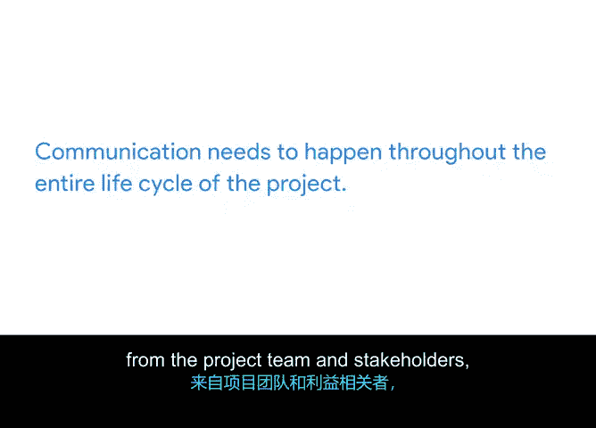

# 043：沟通为何至关重要 🗣️

在本节课中，我们将探讨沟通在项目管理中的核心作用。我们将通过一个生动的例子来理解沟通失败可能带来的后果，并学习有效沟通的定义、重要性以及项目经理在其中的关键职责。

## 沟通失败的例子

让我们从一个例子开始。想象你为你最好的朋友策划了一个惊喜生日派对。你为此准备了一个月，终于到了派对当天。你到达举办派对的餐厅，但遇到了问题。餐厅接待员说预订被取消了，因为没有人确认。一位朋友带来了生日蛋糕，但你曾要求他们带纸杯蛋糕。另一位朋友发短信说，他们很期待明晚与大家见面。在混乱之中，你发现你的朋友已经坐在餐厅的另一边了。这完全不是你想象中的惊喜派对。发生了什么？糟糕的沟通发生了。

以下是沟通失败的具体表现：
*   预订餐厅的朋友忘记告诉你需要提前24小时确认。
*   订购蛋糕的朋友从未看到你要求他带纸杯蛋糕的邮件。
*   你假设群聊里的每个人都收到了派对改到周五而非周六的更新信息。

幸运的是，你的朋友很感激你的努力，并且仍然感到惊喜。虽然你和你的朋友可以对这个混乱的派对计划一笑置之，但如果类似情况发生在工作中，你的老板和同事可能就不会这么想了。

## 沟通为何是项目成功的关键

沟通对每个项目都至关重要。甚至可以认为，它是确保项目顺利运行的最重要工具。很多时候，项目团队的成功或失败，往往取决于每个人是否理解正在发生的事情，以及他们的任务如何贡献于项目目标。

作为项目经理，你在确保每个人了解自己的角色和任务方面扮演着重要角色。你也是团队成员在需要快速答案时会求助的人。因此，能够清晰有效地沟通是关键。必须记住，没有有效的沟通，项目将面临错失重要机会甚至完全失败的风险。

## 一个工作中的沟通案例

在我最近参与的一个项目中，利益相关者分配了几位设计专家与我合作。在项目的第一周，我注意到一位专家没有参加任何项目会议。我决定就他的缺席与他沟通。当被问及时，他表示当前工作量已严重超负荷，无法承诺我分配的紧迫截止日期。

这里存在几处沟通失误：
*   首先是专家与其经理之间的沟通。
*   其次是专家与我（项目经理）之间的沟通。

理想情况下，专家与其经理本应就专家承担此工作量的能力进行更好的沟通。如果我没有与专家沟通，他持续缺席会议可能导致大量时间浪费、项目延迟或无法以令人满意的方式交付项目。事实证明，由于沟通不畅，我们最终只损失了一周的工作时间。然而，由于我迅速跟进，我们得以调整，为项目分配了另一位专家。

## 什么是有效沟通

我们知道沟通非常重要。但沟通究竟是什么？简单来说，沟通是信息的流动。它包括共享的一切内容、共享的方式以及共享的对象。良好、有效的沟通总是清晰、诚实、相关且频繁的，但也不能过于频繁。信息过载是存在的。

有效的沟通使你的项目能够按时运行，并达到项目计划中概述的期望。因此，请充分利用会议、电子邮件、电话、书面文档和正式演示等工具，并确保每个人都能接触到这些信息。同样重要的是要记住，沟通不是一次性事件或单向路径。它需要在项目的整个生命周期中持续进行，信息需要来自项目团队和利益相关者，也需要来自你。

## 项目经理的沟通职责

因此，请务必澄清目标和客户期望，跟进行动项，并在项目进展过程中沟通延迟。这将帮助你避免问题和挫折。作为项目经理，你有责任在整个项目中创建一致的沟通流。为团队沟通设定基调，并努力确保在每一步中每个人都保持一致，这将为你的项目提供最大的成功机会。

## 总结与预告

希望现在你已经清楚，沟通对于管理项目至关重要。接下来，我将向你展示如何制定一个沟通计划，以帮助你管理所有重要的沟通。我们稍后见。