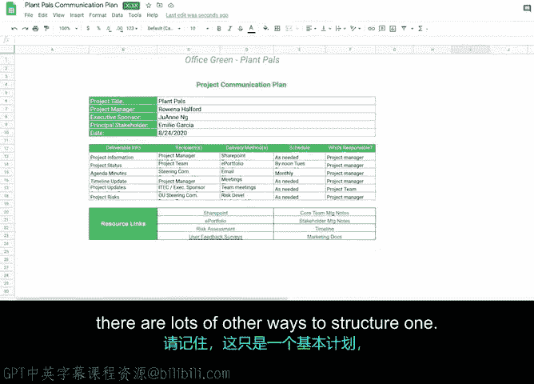

# 044：将一切整合起来

## 概述
在本节课程中，我们将学习如何创建一个沟通计划。沟通计划能帮助你管理项目期间发生的所有不同类型的沟通，确保信息传递有序、高效。

---

### 启动沟通计划

到目前为止，你已经了解了一些项目期间常见的沟通方式。

现在，让我们更进一步，学习如何创建一个沟通计划。这个计划将帮助你管理项目期间发生的所有不同类型的沟通。

项目中的沟通会非常多，因此你需要一个计划来帮助你全面掌握情况，并将其作为有效沟通的工具。

沟通计划用于组织和记录项目的沟通过程、类型和期望。

每个项目的沟通计划规模和复杂程度都不同，但拥有一个计划总是有益的，尤其是在涉及多个利益相关者、不同项目阶段和变更管理时。它将对你、你的项目和利益相关者都大有裨益。

与其他项目相关计划类似，你的沟通计划需要回答以下问题：
*   需要沟通什么？
*   谁需要沟通？
*   何时需要沟通？
*   为何以及如何沟通？
*   沟通的信息存储在哪里？

接下来，我们将用一个为“植物力量”项目创建的示例沟通计划来逐一分解这些问题。

首先，你的沟通计划应包含沟通的内容，或者说沟通的类型。这可能包括状态更新、问题、用户反馈、每日站会以及其他类型的项目会议。

然后，你需要确定沟通的对象。这些是信息的接收者，例如关键利益相关者和核心项目团队。

对于每种沟通类型，记录沟通的时间。这包括沟通的频率（即多久沟通一次）以及关键日期，如截止日期或重要会议。

需要记住的一点是，并非每个人都需要在同一时间接收相同数量的信息。一般来说，你的关键利益相关者接收信息的频率较低，例如通过每月高层摘要邮件或项目评审会议。而你的核心项目团队则可以通过每日邮件更新或快速的虚拟站会接收更详细的信息。

接下来，包含你将如何沟通，或者说你将使用什么交付方法。这可以是电子邮件、面对面或虚拟会议，也可以是正式演示。

你的计划还需要包含沟通的目标。这就是你的“为什么”。所以问问自己：为什么要进行这次沟通？是为了提供进度更新、识别风险并解决障碍，还是需要确定后续步骤、详细制定准备计划或反思经验教训？沟通的目标可能是上述任何一项的组合，也可能是其他原因。无论如何，沟通必须有目的，否则你可能会浪费宝贵的时间。

最后，包含沟通资源的存储位置以及其他任何备注。我将在下一个视频中详细讨论存储信息的最佳实践，但现在请记住，相关信息应易于访问，以便你、你的利益相关者和你的团队能够快速找到他们所需的资源来做出决策、处理任务、了解最新情况或提供更新。

一个有效的沟通计划还有一个好处，那就是它能确保项目运营的连续性。如果一位新的项目经理加入项目并看到这个计划，他应该能够快速访问过去的会议记录和文档，以及当前和即将进行的沟通信息。

此外，沟通计划也有助于有效的变更管理，即交付最终项目并使其成功实施的过程。当你离开项目后，其他人如果能够访问沟通计划，他们将能够解决可能出现的任何问题、做出决策或将类似流程应用于新项目。

希望现在你对沟通计划如何引导项目走向成功有了更深入的了解。

请记住，这只是一个基本计划，构建沟通计划还有很多其他方式。具体取决于你正在处理的项目类型。

---

### 总结
本节课中，我们一起学习了创建沟通计划的核心要素。我们明确了计划需要回答的关键问题：沟通内容、对象、时机、方式、目的及存储位置。一个清晰的沟通计划是管理项目信息流、确保团队协同一致并最终推动项目成功的重要工具。