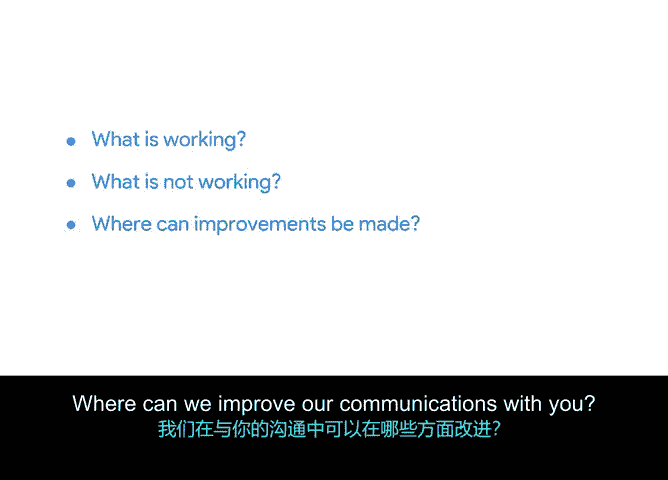

# 045：将一切整合起来 🗂️

## 概述
在本节中，我们将学习如何制定一个有效的沟通计划。沟通计划是项目管理的关键组成部分，它明确了谁需要接收信息、如何沟通、为何沟通以及沟通的频率。我们将通过一个实际案例，一步步构建一个沟通计划，并探讨其中的核心要素。

---

## 制定沟通计划 📝

现在你已经了解了沟通计划是什么以及它的基本构成类别，下一步就是填充你的计划。在本视频中，你将学习如何建立一个最适合项目中所有不同参与者的沟通计划，以及计划中应包含哪些信息。

### 规划沟通的关键益处
提前规划沟通有几个关键好处。创建沟通计划有助于提高沟通的整体效率，在整个项目过程中保持人们的参与度和积极性，并使利益相关者参与到有效的对话中。

### 构建示例沟通计划
让我们尝试构建一个示例沟通计划，以便你了解它如何帮助管理项目沟通的不同方面。我们将继续使用Office Green公司的“植物力量”项目。

以下是一个使用电子表格的基本沟通计划示例。

#### 确定沟通类型
首先，思考你在整个项目中将使用哪些类型的沟通。你可以随时参考你的RACI矩阵和利益相关者地图，这些工具将帮助你确定对每个人、每个小组或每个角色最有效的沟通类型。

在这个例子中，假设利益相关者是忙碌的高级管理人员，他们可能不需要日常细节。因此，与其召开每日会议，不如发送一份总结关键里程碑和项目进展的通讯简报。让我们输入这个。

另一方面，核心团队可能受益于每日站会。这是一种每日会议，旨在让每个人了解关键信息。在站会上，每个团队成员简要描述已完成的工作和遇到的障碍。这在敏捷项目管理中很常见，因为它有助于团队保持协调并在整个项目中快速推进。所以我们将在此行输入“每日站会”。

但有时，由于时区限制或其他义务，无法进行每日会议。别担心，还有其他方法可以保持沟通畅通。例如，创建此计划的项目团队曾使用每日电子邮件状态更新，让整个团队报告当天正在处理哪些行动项。他们还使用项目跟踪器来管理任务和里程碑，以确保每个人都在同一页面上。

#### 确定沟通接收者
接下来，思考谁需要接收关于你项目的信息。这些就是沟通接收者。再次回顾利益相关者地图和RACI矩阵会很有帮助。问问自己：谁需要深度参与细节？谁对项目有高度兴趣？谁只需要被告知主要里程碑？

我已经提到关键利益相关者将收到月度通讯简报，所以我现在输入。同时，我们知道核心团队将参与每日站会，所以我也添加进去。

很好，我们进展顺利。接下来的接收者是市场营销、采购和产品开发的项目子小组。除了核心团队会议，让我们为每个小组添加单独的会议。由于这些子小组不是核心团队的一部分，你可能只想每周与他们开会，而不是每天。让我们为每个小组添加“每周检查”。

#### 添加联系信息和时区
另一个最佳实践是在沟通计划中列出联系信息和时区。这样，你就知道人们何时可以进行沟通。让我们设置这一列。你可以选择隐藏此列，因为它包含项目参与者的敏感信息。还有其他方法可以私下列出联系信息，并整理成工具包以便参考。我将在另一个视频中教你如何操作。

#### 确定沟通频率
如果你难以决定使用哪种沟通类型，一种方法是思考沟通频率。如前所述，高级利益相关者可能无法参加每日会议，他们也不需要每一条信息。相反，你可以每周或每月与高级利益相关者沟通一次，并专注于高级别的状态更新，如整体进展、近期成果或达成的里程碑以及当前指标。在这种情况下，让我们每月发送一次项目通讯简报。如果你不确定，询问高级利益相关者哪种沟通方式最适合他们总是很好的做法。

当你与核心团队在项目上合作时，你需要深入到更多的日常细节中。定期检查，询问一切进展如何，他们的任务完成情况，以及是否需要你的帮助。为你的核心团队添加每日会议，为子小组添加每周会议。让我们实现这一点。更频繁地开会有助于解决问题并使项目保持在正确的轨道上。

#### 列出关键日期
这引出了关键日期。列出关键日期和时间对于协调很重要。例如，如果你要发布产品、新流程或进行演示，你应该列出关键日期。请记住，并非每种沟通类型都需要列出特定的关键日期。例如，对于每日或每周的沟通，你可能不需要指定每周的具体日期，你可以只列出“每周一”之类的。让我们在计划中添加关键日期。

对于月度通讯简报，让我们在每个月的第一个星期一发送。将每日站会安排在中午。每周检查安排在星期三的2点、3点和4点。

#### 选择交付方法
现在让我们谈谈交付方法，如电子邮件、面对面会议和虚拟会议。定期更新的共享文档或提交的进度报告。决定最佳的沟通方式是一项技能。作为项目经理，我不断需要适应并努力改进的一件事是在不同团队和不同权力层级之间进行沟通。

一位总监或高管可能只有五分钟时间，所以我需要简洁明了，并确切知道我需要从他们那里得到什么。同样，我可能习惯通过即时消息和视频聊天与我的核心团队沟通。然而，项目中的一个子小组可能对电子邮件和文档评论反应更好。

让我为我们的沟通计划添加这些方法，从电子邮件开始。电子邮件是一种非常常见的让人们同步信息的方式。但如果写得太多，你可能会失去听众。毕竟，没有人真的想读一封两页长的电子邮件。解决这个问题的一种方法是在邮件顶部添加一个说明。这会提醒读者，长邮件中的某些细节可能与他们无关。对于这类邮件，用两到三句话引出关键点和行动项，然后在底部为那些想要或需要更多细节的人包含一个较长的部分。

沟通的目标是有效地传达你的观点。因此，仔细思考你需要通过每种沟通方式实现什么目标。

特别是对于高级别利益相关者，我一直在试图回答：“那又怎样？他们为什么应该关心我的项目？”对我的核心团队也是如此。哪些信息将有助于确保他们按时完成任务并保持积极性？思考这些问题有助于我专注于分享最重要的信息。

#### 明确沟通目标
所以让我们在沟通计划中填写这一项。给利益相关者的月度通讯简报的目标是提供状态更新概览。很好。与核心团队的每日站会的目标是报告进度更新、障碍和确定下一步行动。让我们也把这些加进去。

#### 分配发送者和负责人
接下来，你需要确保能够联系到所有你需要沟通的人。因此，如果沟通是团队共同努力，尤其是在更复杂的项目中，会很有帮助。你不应该是唯一进行沟通的人。你希望让其他团队成员根据他们在项目中的专业知识参与到沟通中来。我将添加一列“发送者/负责人”来表明谁负责每次沟通。然后，我将为每种沟通类型添加发送者或负责人，从项目经理作为通讯简报的发送者开始。

#### 检查沟通效果
很好，我们都完成了。请记住，与每个人沟通以确保沟通满足他们的需求总是一个好主意。每个人吸收信息的方式不同，对你最有效的方式并不总是对他人最有效。有些人更视觉化，希望看到图表；有些人可能更喜欢通过演示或会议来听取信息；有些人可能希望先自己审查和分析信息，然后再与某人讨论他们阅读的内容。因此，如果你只以一两种方式呈现信息，你可能会吸引某些人，但无法吸引其他人。作为项目经理，你的目标是优化和简化沟通。

为团队中的每个人优化沟通的一个好方法是发送一封简短的电子邮件或调查，询问三个问题：
1.  我们与您就项目进行的沟通中，哪些方面是有效的？
2.  我们的沟通中哪些方面无效或效果不佳？
3.  我们在与您的沟通中可以在哪些方面进行改进？

这将为你提供大量有用的信息，告诉你如何调整沟通风格以适应每个团队成员。

---

## 总结
沟通计划包含许多重要信息，并且根据团队规模和项目需求，有无数种不同的设置方式。无论你选择使用哪种系统，最重要的是确保你的沟通计划清楚地确定了谁需要参与项目沟通、使用什么方法进行沟通、为何沟通以及沟通的频率。

这就结束了我们关于如何有效填充沟通计划的讨论。在下一个视频中，我将与你分享一些最佳实践，用于记录你和你的团队在整个项目中将沟通的所有信息。稍后见。😊