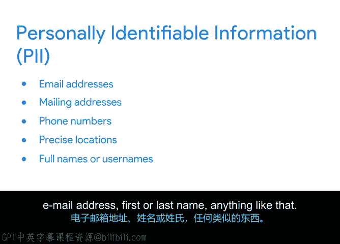

# 046：项目文档的价值 📄

在本节中，我们将探讨项目文档的重要性。文档不仅是记录信息的工具，更是一种沟通形式，可供他人参考和贡献。我们将了解如何通过有效的文档管理来优化团队协作、确保项目连续性，并保护敏感信息。

## 文档作为沟通与协作的中心

上一节我们讨论了项目规划的基础，本节中我们来看看如何通过文档将计划落到实处。文档的存储与共享至关重要。将所有计划集中存放在一个位置，可以使沟通更快速、更简单、更顺畅，因为每个人都知道去哪里查找所需信息。

确保文件有清晰的标签或组织在文件夹中也同样重要。例如，在我的团队中，我们将特定报告存储在一个中心位置。这使得不同国家的团队更容易找到并分享彼此的研究，从而优化工作流程并减少重复劳动。

## 文档提供可见性与责任归属

记录和组织计划还能提供可见性并明确责任归属。你的项目计划就是一个很好的例子。😊

以下是项目计划的核心作用：
*   **明确责任**：每项任务都有指定的负责人（`owner`）和截止日期（`due date`）。
*   **提升可见性**：这为项目团队成员创造了透明度，也让任务负责人承担起责任。
*   **便于参考**：团队成员和高级利益相关者在需要回顾时间线或里程碑时，通常会参考你的项目计划和相关文档。

因此，保持计划的最新状态有助于确保没有误解或沟通不畅的空间。

## 管理权限与确保项目连续性

创建了文档的集中存储位置后，接下来需要考虑管理文件和文件夹的权限。😊

如果某人不是项目团队的核心成员，你可能不希望他们拥有所有会议记录的完全访问权限。相反，你可以将相关信息总结成状态报告，分发给那些需要了解最终结果但不需要所有背景信息的人。

集中管理项目计划还有另一个巨大好处：**连续性**。作为项目经理，有时你可能需要突然离开项目，例如生病、调任到其他项目或需要休假。这时可能需要另一位项目经理接手。

如果所有项目信息都散落在杂乱无章的个人笔记中，这对接任者毫无帮助。但如果你将所有计划都记录在一个集中的地方，新的项目经理就能找到他们所需的一切，并从你离开的地方无缝接手。

因此，将指南、手册、会议记录、计划和流程全部存储在中心位置并清晰标注，总是很有用的。你还需要确保相关角色的人员被授予这些文档的访问权限。这样，即使你不在场，项目也能继续进行。

## 知识管理与信息共享原则

作为项目经理，确保项目数据未来能被他人访问是你的职责。记录你的计划并使其可用，是称为**知识管理**的项目管理最佳实践的一部分。

如果有人需要审查此项目以做出决策或规划类似项目，他们应该能够轻松访问所需信息。这也有助于为未来的项目和未来的项目经理设定基调，如果你恰好是接手新项目的人，这将非常有帮助。

例如，如果一位建筑师正在进行厨房改造，并想就设计做出决定，他们可以查看旧的项目计划，以了解当初为何决定将水槽放在特定位置。或者，如果一位新建筑师在改造中途加入，他们可能想知道另一位建筑师为何以某种方式设计管道。通过查看旧计划，他们可以回溯并获得所需的信息和背景，从而做出更明智的决策。

## 确定共享信息的对象、内容与时机

确定与谁、在何时共享何种信息同样重要。重点关注与特定个人需要知道的内容相关的关键信息。

考虑这个场景：一位与公司所有副总裁合作的项目经理决定每天发送更新。从沟通的角度来看，项目经理的决定可能产生什么潜在影响？由于副总裁会收到大量电子邮件，他们不太可能阅读这些更新。这对你来说是浪费时间。此外，当你发送大量不必要的信息时，就很难分辨什么是真正重要的。

当你处理包含敏感数据的项目时，弄清楚要共享的正确信息就更为重要。在这些情况下，你需要非常小心如何与没有权限查看敏感数据的利益相关者共享项目信息。

例如，财务数据或用户调查结果通常高度敏感，绝不应提供给未经授权的查看者。

以下是另一个场景：假设你的团队正在高调推出一款全新产品，比如一款电动汽车。大多数人不需要知道项目背后的所有想法或看到所有草案版本，但他们确实需要知道最终设计会是什么样子。该项目在法律上很敏感，你需要避免泄露和过度分享机密数据。

如果你将与最终结果相关的整个项目文件夹分享给只需要知道结果的人，你就有可能泄露高度敏感和机密的数据。如果这些信息泄露给错误的人，项目计划和公司数据可能会被公开，从而毁掉电动汽车的重大发布。你还可能违反公司政策，并损害你作为值得信赖和负责任的项目经理的声誉。

**只根据需要共享信息**。你的工作是在正确的时间向正确的人呈现正确的信息。

## 实践案例：处理敏感信息

现在让我展示一个例子。在这个示例沟通计划中，其中一项资源是用户反馈调查。该资源包含从植物动力测试用户提交的调查中收集的原始数据，这意味着它包含个人身份信息（PII）。PII是任何可能泄露某人身份的信息，如屏幕名称、密码、电话号码、电子邮件地址、名字或姓氏等。

因此，**只将该资源分享给被批准访问此级别信息的项目团队成员**。然后，如果任何其他人试图打开该文档，系统将提示他们需要请求访问权限。

如果你需要分享这些调查的结果，可以将其呈现在图表中，或在报告中总结，而不包含任何PII。然后，你就可以与更广泛的团队分享这些信息。

## 总结

本节课中，我们一起学习了项目文档的核心价值。我们了解到，集中化、组织良好的文档是高效沟通和协作的基础，它能明确责任、确保项目连续性，并构成知识管理的关键部分。同时，我们必须谨慎管理文档权限，根据“需要知道”的原则分享信息，特别是在处理敏感数据时，以保护项目和公司的利益。

接下来，我们将学习如何最佳地整合你的计划并保持组织有序。下次见。