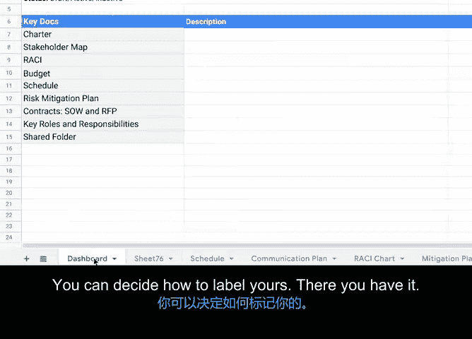

# 047：将一切整合起来

## 概述

在本节课中，我们将学习如何将所有项目规划文档整合并组织在一个集中的位置。这将帮助项目团队更高效地访问信息，减少混乱，并确保项目的顺利进行。

---

## 组织项目文档 📁

到目前为止，在本课程中，我们已经填写或创建了多种项目规划资源，例如项目计划、预算、RACI矩阵、风险管理计划以及沟通计划。我们还讨论了组织沟通和便捷、恰当地访问项目计划的重要性。

现在，我将向您展示一种将所有项目信息集中组织在一个地方的方法。您可以将这些通用的技术应用到几乎任何类型的项目管理风格或系统中。

### 组织项目计划的好处

组织您的项目计划能使每个人的工作更轻松，并消除产生混淆的机会。作为项目经理，您的目标是让所有项目资源都被记录并链接起来，以便您或项目中的任何成员都能快速访问他们所需的信息。

### 组织文件的实用方法

以下是两种实用的组织方法：
1.  使用共享文件驱动器（如 Google Drive）。
2.  创建一个资源（如文档或电子表格），用于链接项目使用的所有文件和资源。

以下是一个在 Google Drive 中组织文件的示例。但无论您的项目团队使用哪种共享系统，这个过程都基本适用。

### 创建项目文件夹

首先，创建一个新文件夹，并用您的项目名称命名。使用此文件夹存储所有项目文件。您甚至可以在主项目文件夹内创建子文件夹来进一步分类存储。

### 创建集中规划文档

您还可以通过创建一个将所有内容链接在一起的集中规划文档来保持条理。这可以作为一个快速参考指南，帮助您在一个地方找到所有经常访问的文件。

以下是一个已开始创建的 Office 屏幕示例。您可以逐一选择资源名称，然后为其添加链接。😊 现在，您可以直接从集中文档访问该文件。

### 整合多个电子表格

如果您的项目使用多个电子表格，并且希望避免打开许多单独的文件，您可以将它们分组在一个工作表中，如下所示。这个工作表包含了所有包含项目信息的其他工作表的标签页。您可以随时添加新的工作表。

### 包含概览页

在集中文档中包含一个概览页并链接任何非电子表格文件是很有帮助的。这也是提供项目简要描述、工作表使用说明或沟通期望的好地方。在这个例子中，概览页被称为“仪表板”，其功能相同。您可以自行决定如何命名您的概览页。

### 完成组织

现在，您已经完成了组织工作，准备好向所有人展示您是一位多么出色的项目经理了。😊

---

## 总结

本节课中，我们一起学习了如何通过创建集中的项目文件夹和规划文档来有效组织所有项目资源。这种方法不仅提升了信息访问的效率，也减少了团队协作中的潜在混乱，是项目经理展示专业能力的重要一步。