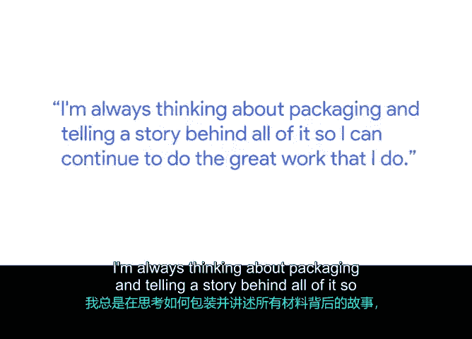
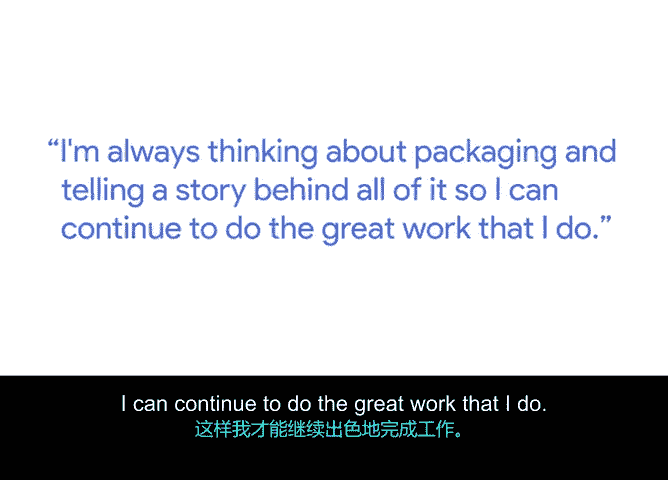
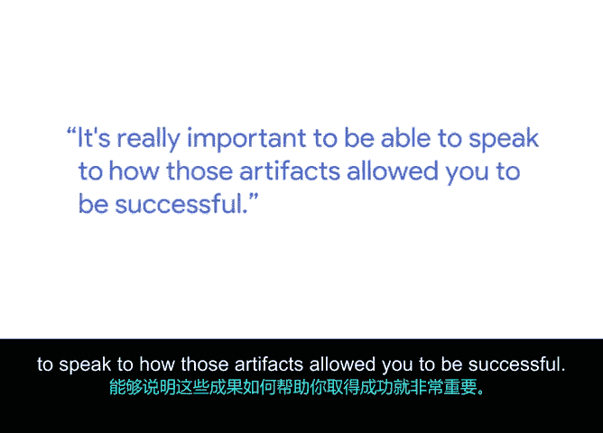

# 048：为求职面试整理项目成果

在本节课中，我们将学习如何整理和展示项目成果，即“项目工件”。这对于项目执行过程中的沟通至关重要，也是求职面试时证明个人能力的关键材料。

---

大家好，我是克里斯。我是谷歌的一名多元化项目经理。我负责为谷歌的一个业务部门制定并领导多元化项目和战略。我的工作重点是针对公司内代表性不足的员工群体，例如黑人、拉丁裔和原住民员工，设计多元化项目。作为一名经理，我每天都需要思考：我负责的项目需要哪些人参与？谁会愿意投资并支持我想要推行的项目？因为我需要获得相关方的认可，项目才能获得批准。因此，我总是思考如何组织我的材料，如何包装并讲述项目背后的故事，以便我能持续开展出色的工作。

上一节我们了解了项目工件的重要性，本节中我们来看看如何具体定义和运用它。

## 什么是项目工件？

项目工件是指你为描述或展示正在进行的工作而整理出的任何有形材料。

以下是项目工件的几个例子：
*   **执行简报或项目概述**：一份描述工作内容的文件。
*   **角色与职责表**：一份战术性文件，用于分解团队中每个人的任务分工以及汇报对象。

保持项目工件的条理性非常重要，这不仅是为了我个人使用，也是为了所有与我协作的人。这包括需要为项目签字批准的**利益相关者**，或者参与项目的**团队成员**。我经常引入志愿者或全职人员来帮助构建我负责的项目。此外，如果涉及**外部供应商**，他们也需要了解自己在整体计划中的位置，以及为促成项目成功需要具体执行哪些任务。

因此，妥善保管项目工件能帮助你在项目管理的各个方面取得最佳成果。无论项目大小，你都希望能在最后展示你的工作成果。这样，当需要为项目申请更多预算或将项目推向新阶段时，你就能有一个良好的基准，清楚地了解项目的起点以及你已经取得的进展。当你拥有所有这些工件时，能够阐述它们如何帮助你取得成功至关重要。

## 项目工件的核心价值

项目工件能切实地向他人展示，是你完成了那些使项目成功的工作。

在求职面试中，如果你只是泛泛而谈某个项目，面试官可能会希望了解更详细的细节。而项目工件能让你展示这些细节，不仅能展示项目的进展和成果，还能展示你个人对项目的贡献。它从有形层面证明了你有能力**从头到尾主导整个流程**。

打个比方，你就是**四分卫**，而四分卫也掌握着**战术手册**。如果你没有战术手册，除了你之外，团队里还有谁知道该怎么做呢？是你主导着整场演出。

因此，无论在项目进行中还是之后的面试场合，你都需要确保能够有效地展示你为促成项目成功所做的一切。

---

本节课中，我们一起学习了项目工件的定义、实例及其核心价值。关键在于，系统性地整理项目过程中的所有材料，不仅能提升当前项目的管理效率，更能为未来的职业发展（如求职面试）提供有力的能力证明。记住，你就是掌握“战术手册”并主导项目全局的“四分卫”。