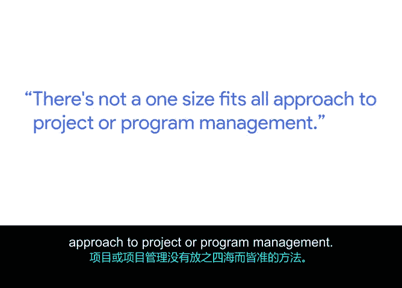

# 049：项目文档的重要性 📄

在本节课中，我们将学习项目文档的核心作用、组织方法以及如何创建和维护有效的项目文档。主讲人丹是谷歌研究院的项目经理，他将分享他在管理复杂项目时积累的实践经验。

## 概述

大家好，我是丹，目前在谷歌研究院担任项目经理。我的主要工作是确保我所合作的各个团队，无论是负责实施研究成果的产品团队，还是需要为未来项目定义研究方向的研究团队，都能保持目标一致、信息同步。

为了实现这一目标，我的大部分工作都围绕着有效沟通和创建详细的文档展开，以便每个人都能将零散的信息串联起来，理解项目的全貌。

## 文档泛滥与“主文档”策略

在项目管理实践中，我观察到一个普遍现象：文档数量激增，有时甚至会导致“被一千份文档淹没”的局面。因此，建立一个**主文档**变得至关重要。

这个主文档的核心作用是**集中管理**所有与项目执行相关的子文档或较小文件。即使这些文件实际存储在其他位置，你只需访问主文档，就能找到所需的一切。

例如，在我的主追踪文档中，我可以链接到：
*   项目章程
*   项目预算
*   已达成一致的范围说明书
*   审批矩阵（即所有需要审批事项的清单）

通过从一个中心点链接到所有必要资源，我能确保自己总能从这里出发，找到需要的信息。

## 文档的定制化与动态性

项目管理没有放之四海而皆准的方法。因此，文档需求也因项目而异。

你可能为某个项目制定风险管理计划，但另一个项目则不需要。根据项目特点，你可能还需要其他类型的文档。所以，保持一切井井有条，并从一个中心文档开始工作，是我能给出的最实用的建议。

在项目或程序管理文档方面，一个更广泛的趋势是：**文档不是一蹴而就的**。

无论是项目计划还是项目章程，你都不可能一次就完成。你必须不断地回顾、修订并更新它。项目文档是**“活”的、需要持续维护的**。

## 详细文档的价值

在文档中尽可能做到详细，具有长远价值。

详细的文档能让你在后期减少反复修改的次数。因为信息越清晰、越完整，团队第一次就把事情做对的可能性就越大。

## 总结

本节课我们一起学习了项目文档管理的关键要点。我们了解到，面对可能出现的文档泛滥问题，建立一个集中所有链接的“主文档”是高效的解决策略。同时，文档需要根据项目具体情况定制，并且它们不是静态的，而是需要持续维护和更新的“活”文件。最后，在文档创建初期投入精力，力求详细和准确，能够有效减少后期的迭代工作，提升项目执行效率。