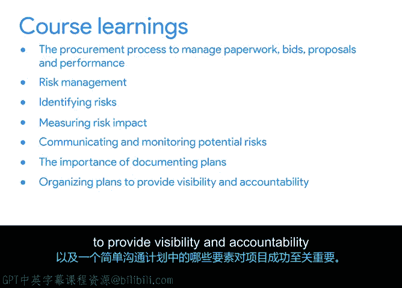

# 050：课程总结

在本节课中，我们回顾了《项目规划：将一切整合起来》课程的全部核心内容。我们一起学习了项目规划阶段的关键组成部分、预算管理、风险管理以及计划文档化的重要性。

## 课程内容回顾

到目前为止，你已经完成了大量工作。让我们花点时间回顾一下你在本课程中学到的所有知识。

首先，你学习了规划阶段的关键组成部分，并探讨了适当的规划如何确保里程碑和任务的完成。

接下来，你学习了为什么有必要创建和管理项目计划。

你学习了如何利用时间估算方法来防止项目失败。

你学习了如何运用软技能获得可行的估算，以及可以使用哪些工具来构建项目计划。

然后，你学习了项目预算的组成部分是什么。

你学习了预算流程如何运作，以及估算和跟踪项目预算背后的概念。

我们还讨论了采购流程如何运作以管理文书工作、投标、提案和绩效。

你也学习了风险管理，以及它如何帮助防止项目失败。

你学习了如何识别风险并衡量它们对项目的影响，以及一旦识别出潜在风险后，如何沟通和监控它们。

最后，你学习了记录计划的重要性。

你学习了如何组织计划以提供可见性和问责制，以及一个简单沟通计划的哪些要素对项目成功至关重要。

## 后续课程预告

在下一门课程中，你将进入项目的执行与收尾阶段，我的同事Eliita将担任你的向导。

她将教你所有关于跟踪和衡量项目进展的知识，包括风险管理、使用数据做决策以及有效的项目沟通。

我很高兴能与你们分享我的项目管理经验。祝你们好运。😊

---

**本节课总结**：本节课中，我们一起系统回顾了项目规划阶段的核心知识体系，包括计划制定、时间与预算估算、风险管理及计划文档化。这些是确保项目按预定轨道成功推进的基石。