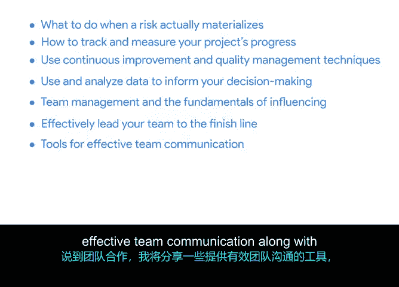

# 001：推动项目 🚀

## 概述

在本节课中，我们将学习如何将项目计划付诸行动，进入项目执行阶段。我们将探讨风险管理、进度跟踪、质量保证、数据驱动的决策、团队管理以及项目收尾等核心内容，确保项目顺利推进并成功完成。

---

## 课程介绍与讲师背景

大家好，我是Eliita，本课程的讲师。我在谷歌担任高级工程项目经理，目前负责领导谷歌地图的路由和导航团队。我于2007年加入公司，曾在纽约、伦敦和西雅图的谷歌工程组织团队工作。2013年，我加入谷歌地图团队，推出了节假日营业时间和商家属性等热门功能，并领导了从纽约到悉尼再到海得拉巴的全球团队。我热衷于解决问题和学习新事物，每一个新项目和团队都为我提供了这样的机会。我很高兴能带领大家学习本课程，演示如何将项目计划付诸行动。

---

## 课程核心内容概览

上一节我们介绍了课程和讲师背景，本节中我们来看看本课程将涵盖的核心模块。

以下是本课程将要学习的几个关键方面：

*   **风险管理与变更应对**：首先，你将深入了解项目中的风险和不可预见的变更。如果你学习过之前的课程，可能会记得变更是不可避免的。为了应对变更，我们在规划阶段已经介绍了风险缓解的概念。现在，我们将更进一步，讨论当风险真正发生时该如何处理。
*   **进度跟踪与质量管理**：接下来，我将讨论跟踪和质量。你将学习如何跟踪和衡量项目的进度，并学习如何使用持续改进和质量管理技术，使项目保持在正轨上并平稳运行。这些最佳实践对几乎所有角色都很有价值。
*   **数据驱动的决策**：项目运行的其他重要方面包括决策。你将学习如何利用和分析数据来指导决策，进而利用这些数据来探索和解释项目的关键方面。
*   **团队管理与影响力基础**：我还将讨论团队管理和影响力的基础。项目的成功很大程度上依赖于团队合作，你将了解更多关于你作为项目经理如何有效地带领团队走向终点。
*   **团队沟通与会议组织**：说到团队合作，我将分享一些促进有效团队沟通的工具，以及组织和促进会议的技巧。
*   **项目收尾**：最后，我们将讨论如何结束一个项目。你将学习完成项目所需的步骤，以及与团队一起庆祝工作圆满完成的重要性。

---

## 总结

本节课中，我们一起学习了项目执行阶段的核心框架。从应对风险与变更，到跟踪进度与保证质量，再到利用数据决策、管理团队并有效沟通，最后圆满结束项目。在完成所有规划之后，项目生命周期中的这个阶段是工作得以完成、一切成果汇聚的关键时刻。

准备好开始了吗？请在下一个视频中与我见面，你将学习到跟踪和衡量项目进度的重要性。