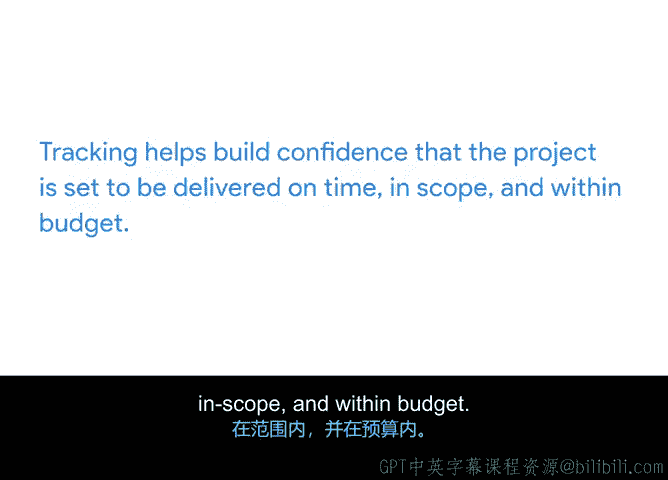

# 002：推动项目

## 概述

在本节课中，我们将要学习项目执行阶段的核心环节——跟踪。我们将探讨跟踪的重要性、它对项目成功的益处，以及为什么它是项目经理在项目执行期间的关键职责。

---

## 跟踪的重要性

在之前的课程中，我们讨论了将项目分解为里程碑和任务，并将这些任务分配给团队成员的重要性。我们也讨论了制定时间表和预算。但是，一旦项目进入执行阶段，你如何真正知道工作正在完成？你可以通过几种方式做到这一点，但主要是通过**跟踪和测量**来掌握项目进度。这实际上是项目管理的重要组成部分。

根据定义，**跟踪**是一种跟进项目活动进展的方法。定期测量项目绩效以识别与项目计划的偏差，有助于确保项目保持在正轨上。**偏差**是指任何改变你原始行动方案的事情。项目计划的偏差可以是积极的，也可以是消极的。你是否因为一个技术问题比你估计的要简单而提前于计划？这是积极的。一场自然灾害是否让你的测试团队停工了？这是消极的。这两个都是偏差的例子。它们也说明了为什么跟踪是你在项目执行阶段角色的关键部分。

接下来，让我们看看跟踪对项目成功有益的一些方式。

以下是跟踪对项目成功的主要益处：

*   **提高透明度与决策质量**：跟踪使关键项目信息透明化，而透明度对于准确决策至关重要。即使是最强的项目经理，在缺乏信息或背景的情况下也会做出糟糕的决策。跟踪将项目信息集中起来，使每个人都能了解项目每个部分的状态，这有助于你识别知识上的空白。此外，项目有太多细节，很难理清一切。跟踪有助于确保你不会忘记某些事情。
*   **保持团队与相关方同步**：跟踪有助于让所有团队成员和相关方了解截止日期和目标，确保每个人都能看到项目进展。你应该有一个既适合你也适合你团队的项目计划。这样，你们对项目进展的理解就能保持一致。在本模块的后面部分，你将学习不同的项目跟踪方法。
*   **及时识别风险与问题**：跟踪对于识别可能阻碍你进展的风险和问题至关重要。通过有效的跟踪，你将能够及时发现问题，并与你的团队合作采取纠正措施。通过提供项目各个部分的可见性，跟踪帮助你和你的团队识别并关注存在风险的领域。
*   **建立项目交付信心**：跟踪有助于建立项目将按时、在范围内、并在预算内交付的信心。对整体项目状态有一个清晰、最新的了解，能使团队保持积极性并专注于既定路线。

---

## 总结

本节课中，我们一起学习了跟踪在项目管理中的重要性。我们了解到，跟踪对于确保项目透明度、进行有效的风险管理以及保持项目按计划进行至关重要。接下来，我们将带你了解在项目执行期间需要跟踪的一些关键事项。