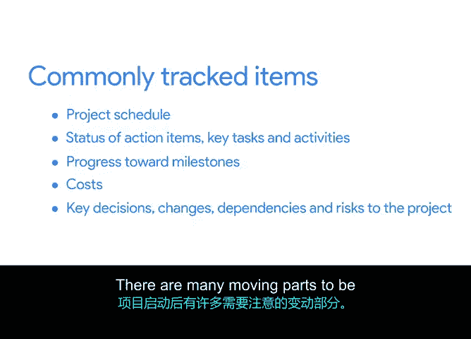

# 003：推动项目｜常见跟踪项


## 概述
在本节课程中，我们将学习项目执行阶段需要跟踪哪些关键信息。有效的跟踪能确保项目按计划推进，达成最终目标。

我们已经讨论了跟踪如何监控项目活动的进展，但你可能仍然想知道，具体应该跟踪哪些内容。我将介绍几个在谷歌管理项目时发现最有帮助的常见跟踪项。

## 核心跟踪项详解
以下是项目执行期间需要密切关注的几个核心方面。

### 1. 项目进度表 📅
首先，你应始终跟踪**项目进度表**。它由确保项目有效朝着完成日期推进的任务和活动组成。毕竟，你的最终目标是按时完成可交付成果。

**公式表示**：`项目进度表 = ∑(任务 + 活动)`，其目标是 `完成日期 ≤ 计划日期`。

### 2. 行动项状态 ✅
同样重要的是跟踪**行动项的状态**，即确保工作真正得以完成的关键任务和活动。跟踪任务也有助于跟踪团队向里程碑的进展。我们在课程早期已经学习了更多关于跟踪里程碑进展的内容，并强调了创建任务和里程碑以保持所有人按计划进行的重要性。

**代码描述**：
```python
if action_item.status == "完成":
    项目向里程碑推进
else:
    需要关注并解决问题
```

### 3. 成本 💰
接下来，你还需要跟踪**成本**，以确保不会在项目任务上超支或支出不足。正如我之前提到的，所有项目都有预算，无论你是否监督整个预算，你都可能监督那些对预算有影响的任务和资源。

**公式表示**：`实际成本 ≤ 预算成本`

### 4. 关键决策、变更与风险 ⚠️
最后，你需要跟踪项目的**关键决策、变更、依赖关系和风险**，包括任何已商定的范围变更。这样，你的团队和利益相关者就能就项目成功需要完成的事项达成一致。我们将在整个课程中更详细地介绍这一点，因为这是运行项目的重要组成部分。

**核心概念**：`项目成功 = 对齐(团队 + 利益相关者) 于 (决策 + 变更 + 风险应对)`

## 总结
本节课中，我们一起学习了项目执行阶段有助于跟踪的项，包括：
*   **项目进度表**：包含关键任务和活动。
*   **行动项的状态**。
*   **向里程碑的进展**。
*   **成本**。
*   **关键决策和变更**。

项目一旦启动，就有许多动态部分需要注意。密切跟踪它们，在你朝着项目目标前进时，对你和你的团队都有益。



我们已经完成了跟踪的入门介绍。接下来，我们将讨论可用于跟踪项目活动的项目管理工具和模板。请在下一个视频中与我见面，以扩展你的工具包。