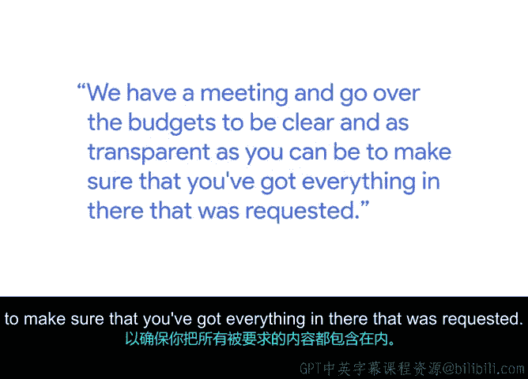

# 005：推动项目｜预算跟踪与管理 💰

## 概述
在本节课中，我们将跟随谷歌项目经理贝琳达，学习如何为数据中心等大型项目构建和管理预算。你将了解到预算的复杂性、构建过程的核心方法，以及从事预算管理工作所需的心态。

大家好，我是贝琳达，是谷歌的一名项目经理。我在谷歌的职责之一是构建预算，这项工作已经持续了好几年。构建数据中心预算涉及很多内容，需要花费相当长的时间。这些预算每年都需要更新，以便为下一年的运营做准备，截止日期是9月1日。预算涵盖了你能想到的一切，从数据中心站点的保洁服务，到作为备用电源运行的UPS（不间断电源）单元。

因此，我过去几年的职责不仅是构建预算，还要与团队和供应商合作，弄清楚随着站点发展需要多少资金。对我而言，我始终使用的方法是创建一个谷歌表格。我年复一年地逐项使用它，并按账户代码和对应的Dchan（数据链）进行细分。这基本上就是分类，无论我们处理的是机械、电气、冷却器维护、草坪维护、RTU（屋顶单元）、机械操作人工，还是电梯、升降机、高尔夫球车、发电机的维修与服务。你需要为维持数据中心运行所需的每一项内容进行逐行列项。

所以，这可能非常复杂且相当困难，但我始终发现，谷歌表格是我构建基础结构的最佳起点。目前，我与四位经理共同制定这份预算。我们会开会审查预算，力求清晰和尽可能透明，以确保包含了所有被请求的项目。多年来的情况是，我们会有一位经理与我共同担任预算的负责人。这样，当我们提交预算并参加总监级别的会议时，站点会有一位设施管理经理实际监督该预算。这取决于你与谁合作，但他们了解自己的需求，并能帮助你理解他们何时需要这些需求以及需要多少资金。

因此，对于任何希望进入项目管理或预算管理领域的人，我认为他们真的需要知道自己热爱数学，并且需要它。

## 拥抱变化与分解任务
上一节我们介绍了预算的构成和协作方式。本节中我们来看看预算管理者的心态和应对复杂性的方法。

我喜欢变化，因为在项目管理和处理预算时，变化经常发生。有时变化是每小时发生的，有时是每天发生的。有时你会度过非常平静的一周，一切按计划进行；而有时则是一片混乱。对我来说，我喜欢忙碌，也喜欢变化，我并不害怕它。但我认为，对这种角色感兴趣的人需要明白，变化是常态。

对于任何开始使用谷歌构建预算的人来说，即使经验丰富，这也可能让人不知所措。对我来说也是如此，我必须找到一个适合自己的平台（即表格），使其有意义，以便我能跟踪它。我认为，我给任何刚开始接触预算的人的建议是：**一天一天来**。你无法在一天内学会所有东西，这可能会让人不知所措，但可以尝试将其分解成更小的部分。

## 总结
本节课中我们一起学习了项目预算管理的基础。我们了解到，预算需要涵盖项目的方方面面，从核心设备到日常维护。构建预算是一个需要细致分类、团队协作和持续跟踪的复杂过程。使用像谷歌表格这样的工具逐项管理是有效的方法。同时，预算管理者需要具备对数字的敏感度、拥抱变化的灵活心态，以及将大问题分解为小任务的能力。记住，预算管理是一个渐进的学习过程，保持耐心和条理是关键。