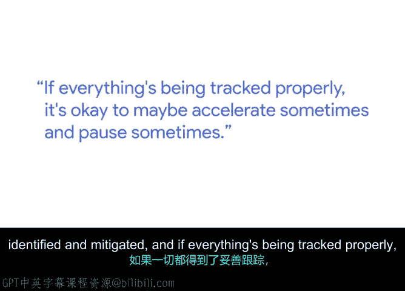

# 006：多轨道管理 🚀

在本节课中，我们将学习如何管理一个包含多个并行任务（轨道）的大型项目。通过谷歌项目经理Pranjal的真实经验，我们将了解如何在保持项目质量的同时，平衡雄心勃勃的目标，并灵活调整各轨道的优先级。

---

大家好，我是Pranjal，在谷歌的站点可靠性工程团队担任项目经理。我们的团队主要负责谷歌所有关键服务的稳定性，是出现问题时首道防线。

我想谈谈我在谷歌管理的第一个大型项目。大约三年前，我与他人共同创立了这个项目，并且至今仍在参与。这个项目的核心目标是：开发一套通用工具，帮助移动应用在生产环境中保持高可靠性。这意味着，当用户使用的移动应用出现问题时，我们的系统能在用户察觉之前就发现问题，并在幕后自动采取修复措施。

项目启动时，我最大的担忧是如何在项目雄心与质量之间取得平衡。在最初的头脑风暴和制定路线图时，我们计划的规模庞大得令人望而生畏。

---

## 管理多轨道的核心策略

上一节我们了解了项目背景与挑战，本节中我们来看看应对多轨道项目的具体策略。我非常感谢当时的经理，她给了我一些极好的建议。

以下是她的核心建议：

*   **非同步推进**：在一个大型项目中，即使有五个不同的工作轨道，也**无需每天同时推进所有五个**。
*   **聚焦与轮转**：你可以选择一个季度，集中精力在**轨道3**和**轨道5**上取得显著进展，同时为其他轨道打好基础，以便在下一季度推进。
*   **动态调整优先级**：作为项目经理，我被授权根据情况**推动或拉后**各轨道的优先级。关键在于确保所有相关人员都清楚当前的工作重点、需要识别与规避的风险，并且一切进展都被妥善追踪。

这个策略让我安心不少。事实上，我认识到，有时**后退一步并暂停**，反而能催生原创性的想法，同时也让团队成员得以喘息。

---

## 课程总结

本节课中，我们一起学习了多轨道项目管理的关键方法。核心在于认识到并非所有任务都需要齐头并进，通过**周期性地聚焦于部分轨道**、**动态调整优先级**，并在必要时**主动暂停以获取新视角**，可以有效管理复杂项目，在追求宏大目标的同时保障项目质量与团队活力。