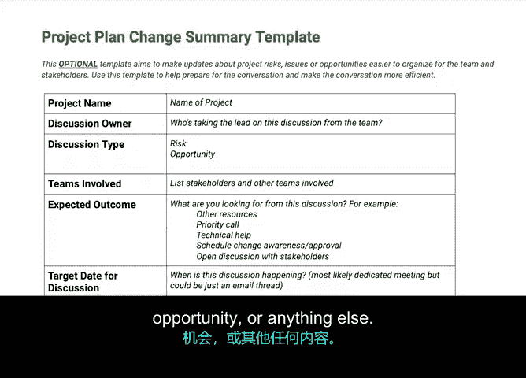

**谷歌项目管理专业证书：第4课：项目执行：推动项目｜P7：风险与变更产生的原因** 🎯

欢迎回来。在之前的视频中，我们学习了如何在项目规划阶段识别风险。

在本模块中，我们将学习项目执行期间风险和变更可能产生的原因，以及它们如何影响项目的范围。

---

### **概述**

在本节中，我们将学习**风险**与**变更**的定义，探讨它们产生的原因，并了解它们如何影响项目的范围、预算和时间线。我们还将介绍用于管理变更的关键工具——变更请求表。

---

### **风险与变更的定义**

你可能还记得，**风险**是指可能发生并可能影响项目的潜在事件。在项目管理中，风险是**假设性**的。换句话说，这些事件不一定会发生，但由于存在发生的可能性，项目经理有责任识别这些风险并为之制定计划。

让我们回顾一些风险示例：
*   承包商错过截止日期。
*   引入新工具可能导致团队内部沟通中断。
*   由于未预见的新政策出台，导致意外增加额外工作。

当任何风险发生时，其结果就是对项目计划的**变更**。

**变更**是指任何改变或影响项目内任务、结构或流程的事情。变更通常是意料之外的，并且往往对项目产生负面影响，项目经理需要学会应对。但有时（请注意是“有时”），变更也可能产生积极影响。

变更可以涵盖与**三重约束**（范围、预算、时间）相关的、对原始项目计划的任何偏离。这可能涉及改变范围的优先级、预算和资源，或改变项目时间线。

接下来，我们将讨论项目的内部和外部依赖关系如何相互影响并引发变更。

---

### **变更的类型**

以下是可能影响项目的几种变更类型示例：

**1. 新的或变化的依赖关系**
依赖关系是指相互依赖的任务、活动或里程碑。如果一个任务未按时完成，可能会延误其他任务。
> **示例**：在浴室改造项目中，新的水槽必须在台面和管道安装到位后才能安装。

**2. 变化的优先级**
项目的范围可能因优先级变化而改变。
> **示例**：客户的岳父母突然要搬来同住，导致你必须提前进行备用卧室的装修工作，从而影响了浴室改造的完成顺序。

**3. 人员与能力的变化**
项目团队的人员或可用资源可能发生变化。
> **示例**：由于在工地上出现问题，你需要更换水管工。

**4. 预算或资源的新限制**
项目的预算或资源可能受到新的限制。
> **示例**：由于电工工作的报价高于预期，你需要将新浴室的设计成本降低10%。

**5. 范围蔓延**
范围蔓延是指变更、增长和其他因素影响项目范围的情况。
> **示例**：客户对新浴室的瓷砖非常满意，因此希望更换所有浴室的瓷砖。

**6. 不可抗力**
这是指因国家或国际危机而发生的变更。不可抗力是指因重大危机导致无法履行合同的不可预见情况。这种情况比较少见。
> **示例**：如果工会举行罢工，某些供应商将无法履行合同；如果发生疫情，新产品的所有生产可能会停止。

---

### **评估变更的影响**

变更应根据项目原始需求所设定的**范围、预算和时间基线估算**来衡量。

请注意，当你改变其中任何一项时，可能会产生连锁反应，可能是积极的，也可能是消极的。

> **示例**：客户认为旧客厅地毯下藏着漂亮的硬木地板，希望掀开地毯使用原来的地板。作为项目经理，你已预算好移除地毯并对旧地板进行打磨和染色。但掀开地毯后，你发现地板状况糟糕且腐烂，需要更换或维修，这可能成本高昂。因此，你的时间线和预算很可能受到影响。

---

### **管理变更的责任与流程**

关于由谁负责管理变化的范围，责任在于**项目经理**。但根据项目情况，你很可能不会独自完成。

为了妥善管理变更，你需要参考**工作说明书**和**RACI图表**等文件，但也可能需要创建一些新的文档。

你需要为团队或组织创建或熟悉**变更请求流程**。这些流程可能包括**变更请求表**。

---

### **变更请求表**

你和项目相关方将使用变更请求表来掌控并妥善管理任何变更。由于项目中许多不同角色的人都可以填写此表，因此表格必须**清晰明了且非常详尽**。

在提供的模板（使用2x10表格）中，你需要在单元格中包含以下信息：

*   **项目名称**
*   **讨论负责人**：团队中负责主导此次讨论的人员。
*   **讨论类型**：告知受众你将讨论的是风险、机会还是其他内容。
*   **涉及的团队**
*   **讨论的预期结果**：可能是优先级变更、进度变更，或关于如何处理问题的正式决定。
*   **讨论目标日期**
*   **可能受影响的里程碑或目标**
*   **当前情况简述**：变更描述，以及对原计划预期做出的任何改变（类似于“前后”快照）。
*   **详细变更提案**：阐述必要的更改，并说明任何权衡取舍。
*   **背景信息**：提供任何背景信息，确保所有人拥有相同的上下文。

你还可以参考**工作说明书**，以获取关于需要哪些人员参与该对话的更多信息。

如果你发现一个或多个里程碑有无法完成的风险，那么你需要在**范围、截止日期或预算变更之前获得客户签字确认**，并且需要通知所有相关方。

---

### **总结**

做得好！我们回顾了如何定义风险，并更深入地了解了项目期间风险和变更可能发生的原因。现在，我们可以解释增加项目范围所带来的影响了。

在下一个视频中，我们将讨论依赖关系所扮演的角色以及如何妥善管理它们。我们下个视频见。