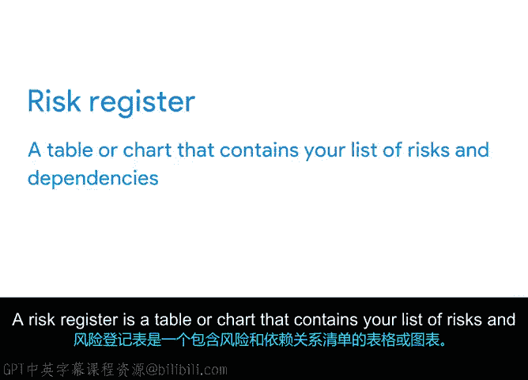

# 008：识别与跟踪依赖关系 🧩


在本节课中，我们将要学习项目依赖关系的概念、类型以及如何有效地识别和跟踪它们。依赖关系是连接项目任务的关键纽带，也是项目风险的主要来源之一。

## 什么是依赖关系？

上一节我们介绍了风险及其对项目的影响，本节中我们来看看依赖关系。依赖关系是连接一个项目任务与另一个项目任务的链接。正如我们提到的，它们通常是项目最大的风险来源。

两个或多个项目任务之间可能存在一种关系，其中一个任务的完成依赖于另一个任务的启动，反之亦然。可以将这些任务想象成一排多米诺骨牌，一个接一个地倒下。如果一个骨牌倒下，它会撞倒下一个，依此类推。

## 依赖关系的类型

以下是几种不同类型的依赖关系，我们将讨论每种类型的几个例子。

### 内部依赖关系

内部依赖关系描述了同一项目内两个任务之间的关系。例如，一家建筑公司可能在全城有多个项目。每个项目都需要在需求、时间表和预算获得批准以及团队选定之前，先选定一名工头和一名项目经理。你不会在明确工作范围并签署合同之前就选定团队并告诉他们开始工作。

### 外部依赖关系

另一方面，外部依赖关系指的是依赖于外部因素的任务，例如监管机构或其他项目。例如，如果一家建筑公司计划拆除一个建筑工地，他们必须等待项目获得市政府的批准。外部依赖关系并不总是在项目经理的控制范围内，但了解它们对于保持项目按计划进行至关重要。

### 强制性依赖关系

强制性依赖关系是法律或合同要求必须执行的任务。例如，当那家建筑公司完成拆除并开始重建时，他们首先必须浇筑混凝土基础，然后由市政府进行检查以确保其符合标准，之后建筑公司才能继续建造。

### 自由裁量依赖关系

自由裁量依赖关系由项目团队定义。这些是可能自行发生的依赖关系，但团队认为有必要使这些依赖关系相互依赖。例如，建筑公司可能正在使用新供应商的混凝土，并希望进行测试，浇筑一部分基础以获得对产品总用量的更准确估算。他们需要先完成基础浇筑，而不是一开始就购买过多或过少的产品。先进行部分基础浇筑的任务，是因为团队在做出决定前需要更多信息。

## 依赖关系管理

项目经理必须努力将依赖关系管理纳入工作流程。依赖关系管理是管理项目中所有这些相互关联的任务和资源的过程，以确保您的整体项目能够按时、按预算成功完成。

为了实现有效的依赖关系管理，项目经理可以采取四个重要步骤：正确识别、记录依赖关系、持续监控与控制以及高效沟通。

### 正确识别

第一步是正确识别。项目经理必须与团队一起集思广益，找出所有可能的项目依赖关系，并对其进行相应分类。

### 记录依赖关系

接下来是记录依赖关系。在识别出所有依赖关系后，应创建一个风险登记册。风险登记册是一个包含您的风险和依赖关系列表的表格或图表。

```
风险登记册示例：
| 依赖关系描述 | 日期 | 受影响的活动/任务 |
| :--- | :--- | :--- |
| 等待市政府批准拆除许可 | 2023-10-26 | 现场拆除、材料订购 |
| 新混凝土供应商样品测试完成 | 2023-10-30 | 基础浇筑、采购订单 |
```



风险登记册应包括对依赖关系的描述、日期以及可能受该依赖关系影响的所有活动或任务。

### 持续监控与控制

然后，项目经理需要保持持续的监控和控制。这意味着您需要安排定期会议来检查相互关联的任务，随时了解任何进展，并仔细检查会影响其他任务的变化。

### 高效沟通

最后一步是高效沟通。让项目团队和利益相关者随时了解情况，有助于解决依赖关系并保持项目的强劲势头。

## 总结

本节课中我们一起学习了如何定义内部和外部依赖关系，并了解了管理和跟踪依赖关系的重要性。我们还讨论了在项目开始时（就像我们的基础示例中）明确定义依赖关系的重要性，并学习了依赖关系管理。在下一个视频中，我们将为您提供管理项目中风险的具体技巧。我们下节课见。