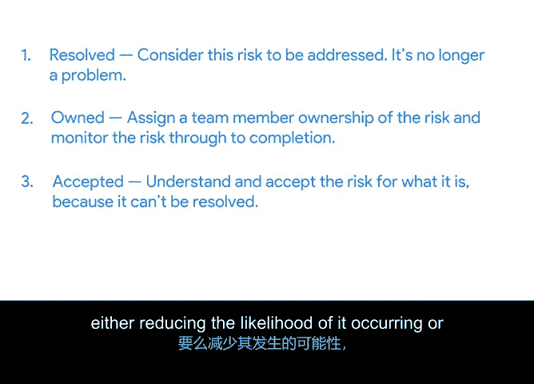

# 009：风险管理技巧 🛡️

在本节课中，我们将学习项目风险管理的关键技巧。我们将回顾风险管理的定义，并介绍几种实用的工具和方法，帮助你识别、评估和应对项目中的潜在风险。

## 风险管理回顾

上一节我们介绍了风险管理的基本概念。本节中，我们来看看更具体的风险管理技巧。

风险管理的定义是：识别可能影响项目的潜在风险和问题，然后评估并采取措施以应对这些已识别风险和问题的过程。

## 管理变更、依赖与范围蔓延

一种管理风险并希望防止其发生的方法是，专注于管理项目中的变更、依赖关系以及任何范围蔓延。

如果你能管理好这两件事——依赖关系的变更和范围蔓延，其他类型的风险就会变得更容易管理。

如果依赖关系按时得到满足，你的团队就不太可能落后于计划。如果范围得到严格控制，你就不太可能发生预算变更或被迫延长时间线。

## 团队头脑风暴识别风险

与你的团队进行头脑风暴是识别项目中风险的最有效技巧之一。

你的队友可能从以往的项目中带来了技能和经验，这有助于发现相似之处，并避免重复出现任何问题。

## 创建风险登记册

在我们与团队进行头脑风暴时，最好创建一个风险登记册。作为回顾，风险登记册是一个包含团队风险列表的表格或图表。

你需要向你的团队提出诸如“什么可以改善项目结果？”或“什么可能损害或阻碍项目？”等问题。

你将把它们全部列为“如果……那么……”的陈述。例如：**如果**某个特定事件发生，**那么**项目将受到如下影响。

## 计算风险敞口

为了帮助在风险登记册中确定风险的优先级，你可以计算风险敞口。风险敞口是衡量由特定活动或事件导致的潜在未来损失的一种方式。

计算风险敞口的一个好方法是构建一个像这样的矩阵。

构建矩阵时，你将使用两个变量：风险影响和发生概率。风险影响在顶部（水平轴），发生概率在侧面（垂直轴）。在两个轴上分别标记高、中、低，从左到右横跨顶部，从上到下沿侧面排列，因为这就是你绘制风险敞口图的方式。

将每个风险添加到图表中，位置取决于该风险可能对项目产生的影响与其发生的概率或可能性的交叉点。

这是一种技巧。但无论你使用何种策略来检查风险敞口，你的风险都需要确定优先级，以便你和你的团队知道哪些风险需要立即关注。对于任何对项目有高影响的风险，即使其发生概率很低，也要确保制定缓解计划。如果风险真的发生，你将如何处理？

## 应用ROAM技术

虽然风险登记册是一个很好的工具，但仍可能出现一些不可预见的风险。在项目过程中几乎不可能考虑到每一个风险。这时ROAM技术可以提供帮助。

ROAM技术代表“已解决、已分配、已接受、已缓解”，用于帮助管理风险发生后的行动。

一旦风险发生，你需要决定如何处理它。

*   **已解决**：如果风险已被消除且不再构成问题，则归入此类别。
*   **已分配**：如果你将某个特定风险的所有权交给一名团队成员，并委托其处理，则该风险归入此类别，并监控直至完成。
*   **已接受**：如果风险已被接受，意味着已达成共识，不采取任何措施。
*   **已缓解**：如果已采取某些行动使得风险得到缓解，无论是降低了其发生的可能性还是减少了对项目的影响，则归入此类别。

将每个风险归入一个类别后，团队将讨论每个风险，并决定哪些应优先处理。

## 总结

本节课中，我们一起学习了如何区分风险与问题，以及一些管理各类风险的新技巧。我们介绍了通过管理变更和依赖来控制风险，使用团队头脑风暴和风险登记册来识别风险，通过风险矩阵计算风险敞口以确定优先级，并应用ROAM技术对已发生的风险进行分类和处理。

接下来，我们将学习如何通过一种称为“升级上报”的技巧与利益相关者分享这些风险。听起来很有趣？请前往下一个视频了解更多。