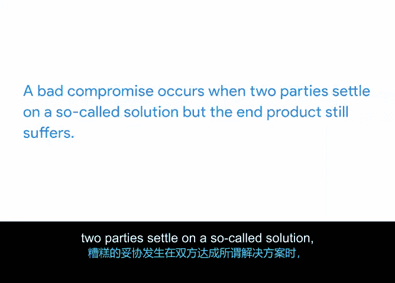

# 010：问题升级策略 🚨

在本节课程中，我们将学习项目管理中一种常用的解决问题策略：问题升级。我们将了解其定义、重要性、实施时机以及如何避免常见的团队协作陷阱。

## 什么是问题升级？

除了其他多项任务，项目经理的职责还包括解决问题并清除阻碍项目成功的限制因素。实现这一目标的一种方法是进行问题升级。

**问题升级**是指寻求更高级别的项目领导或管理层的帮助，以移除障碍、澄清或强化优先级，并确认后续步骤的过程。

## 为何鼓励问题升级？

问题升级看似带有负面含义，但在项目管理中并非如此。在项目管理中，问题升级应受到鼓励、经常使用，甚至值得庆贺。

以下是问题升级的积极意义：

*   **健康的制衡工具**：升级机制是健康的，它作为一种制衡工具，确保采取适当的行动。
*   **加速决策**：升级可以促成快速的决策。通常，问题解决得越快，项目状况就越好。
*   **化解团队僵局**：与其让两个无法达成一致的团队成员来回争论，一个客观的第三方可以帮助做出决定，减少团队内部的挫败感。
*   **促进参与**：邀请他人参与解决问题或承担责任，可以促进团队成员间的信任和共同责任感，这是一个健康、高效团队的标志。

## 如何建立升级框架？

在项目开始工作之前，项目经理、团队和项目发起人应共同建立问题升级的标准和规范。

这意味着他们将明确：
*   **升级对象**：问题应向谁提出。
*   **升级方式**：如何提出问题。
*   **讨论平台**：用于讨论的正式场合或渠道。

预先做一些准备工作，将有助于在需要时顺利进行问题升级。

## 何时应该进行问题升级？

既然我们了解了什么是问题升级以及何时建立其管理框架，那么如何判断何时应该进行升级呢？

项目经理应在项目出现关键问题的第一个迹象时就进行升级。**关键问题**包括：
*   可能导致主要项目里程碑延迟的问题。
*   导致预算超支的问题。
*   可能导致客户流失的问题。
*   推迟预计项目完成日期的问题。

基本上，任何会影响你**三重约束**——**时间**、**预算**和**范围**——的事情，都应该进行升级。

## 升级能预防的两种常见问题

问题升级能有效预防项目中的两种常见问题：**堑壕战**和**糟糕的妥协**。

以下是这两种问题的具体说明：

*   **堑壕战**：当两个同级或团体似乎无法达成一致，且任何一方都不愿让步时，就会发生堑壕战。这会导致项目陷入僵局，并可能延迟项目某些方面的进展。
*   **糟糕的妥协**：我们通常认为妥协是解决问题的积极方式。但确实存在“糟糕的妥协”。当双方就一个所谓的解决方案达成一致，但最终产品仍然受到影响时，就发生了糟糕的妥协。

在涉及重要项目目标的妥协时，仅仅因为这是达到目的的一种手段而勉强接受，对任何一方都无益处。正确的做法是，在妥协的同时，也要牢记更大的项目目标，并共同努力实现这些目标。你可能需要帮助你的团队或利益相关者为了更大的利益做出艰难的选择。

## 总结

在本节中，我们一起学习了问题升级的定义，了解了在向利益相关者沟通和协商变更时如何运用三重约束模型，并认识了项目上两种常见问题：堑壕战和糟糕的妥协。

在下一个视频中，我们将解释更多与团队沟通的技巧，包括“暂停”和“回顾”。我们下个视频见。