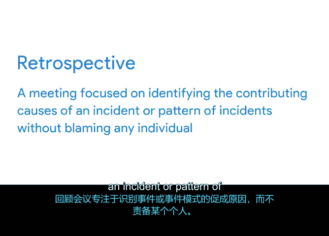

**谷歌项目管理专业证书：第4课：向团队传达变更**

在本节中，我们将学习如何有效地向项目团队传达变更。上一节我们介绍了“升级”及其应用场景，本节中我们来看看沟通变更的具体方法与技巧。

有效的沟通能带来积极的结果，这在项目变更管理中同样适用。向团队成员和利益相关者传达变更，不仅仅是更新跟踪文档那么简单。即使是最微小的变更，对团队中的某些成员也可能意义重大，因此必须进行沟通。同时，你需要根据沟通内容和对象，调整你的沟通策略。

作为项目经理，有时你需要召开团队会议，有时一封邮件就足够了。我个人倾向于先与同事进行一次快速的咖啡间或走廊交谈，随后再发一封邮件记录我们达成的共识。这种方法在需要快速达成一致或议题较为敏感时尤其有用。

那么，如何判断哪种沟通方式合适呢？最终你需要运用自己的判断力。以下是项目经理在决定沟通方式时可以参考的一些方法。

**以下是决定沟通方式的考量因素：**

*   **发送邮件**：适用于传达仅影响个人的小范围变更。务必避免涉及情绪化话题或需要深入讨论的内容。可以先通过邮件告知，再约定会议时间。
*   **召开会议**：当项目发生重大变更，影响超过一人，并可能改变项目预算、截止日期或范围时，你可能需要召开团队会议。
*   **灵活调整**：每周例会并非总是必要，特别是当议程很短时。如果你安排了会议后又决定取消，可以改为发送邮件，或将议题移至其他讨论场合。

在应对项目变更时，一个有用的策略是“暂停”。

**“暂停”是指在项目中暂时停下来，以便喘口气、重新集结并调整计划。** 暂停可能会暂时打断你的工作势头，但从长远来看，它对于最终的成功可能是绝对必要的。

**以下情况可能需要“暂停”：**

*   客户希望重新定义项目范围。
*   团队成员被重新分配到其他项目，你需要制定人员补充计划。

这次暂停是项目团队评估变更、以便根据需要调整计划的机会。

在整个项目过程中，你需要召开会议来讨论成功、挫折以及未来可能的改进。这类会议被称为“复盘会”。

**复盘会贯穿于项目的整个生命周期，其重点是识别事件或事件模式的根本原因，而不是归咎于某个个体。**

在进行复盘时，你应该始终假设每个人都有良好的意图，并且基于当时掌握的信息做出了正确的决定，无论最终结果如何。复盘总是一个学习和改进的机会。

作为项目经理，掌握向个别队友或整个团队有效传达变更的技巧至关重要。现在，你对通过“暂停”和“复盘会”来就项目中发生的事件进行富有成效的对话有了更多了解。我们将在课程后期对此进行更深入的讨论。所有这些都将帮助你成为一名成功的项目经理。

本节课中，我们一起学习了如何根据变更的性质和影响范围选择合适的沟通方式（如邮件或会议），引入了“暂停”策略以应对重大变更，并了解了“复盘会”在持续改进中的作用。掌握这些沟通技巧，是推动项目顺利执行的关键。