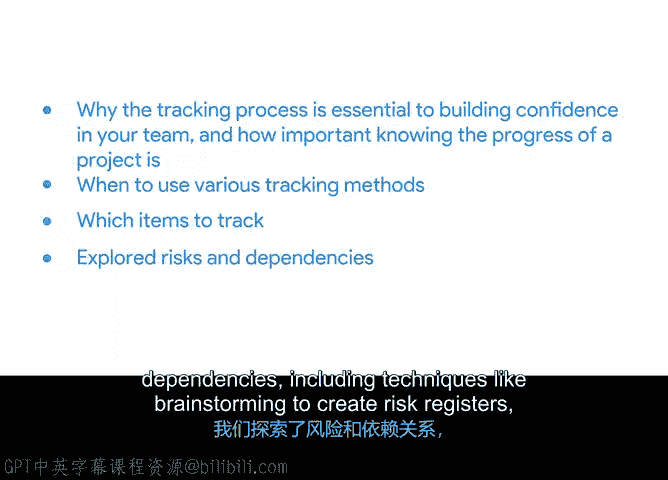

# 012：项目执行总结 🎯

在本节课程中，我们学习了项目执行阶段中关于跟踪、风险与质量管理的核心内容。现在，让我们一起来回顾所学到的关键知识。

## 跟踪过程的重要性

上一节我们介绍了项目执行的基础，本节中我们来看看跟踪过程的核心价值。跟踪过程对于建立团队信心至关重要。了解项目进展对于沟通同样极为重要。

## 项目跟踪方法

以下是三种主要的项目跟踪方法及其适用场景：

*   **路线图**：适用于跟踪高级别的里程碑。
*   **甘特图**：对于存在许多依赖关系的项目非常有用。
*   **燃尽图**：更适合时间紧迫、以细粒度任务为导向的项目。

## 跟踪内容

使用上述图表时，需要跟踪以下关键项目：

*   成本
*   关键任务的状态
*   里程碑的进展
*   新增的待办事项
*   重要决策

## 风险与依赖关系管理

我们探讨了风险与依赖关系，包括通过头脑风暴创建风险登记册等技术。我们还介绍了 **ROME** 技术，它代表：
*   **R**esolved - 已解决
*   **O**wned - 已明确责任人
*   **M**itigated - 已缓解
*   **E**accepted - 已接受

你也学习了变更和依赖关系，以及它们如何影响项目。我们还讨论了如何管理与沟通这些风险、变更和依赖关系。

## 总结与展望

本节课中，我们一起学习了项目跟踪的核心方法、关键跟踪指标以及风险管理的实用技术。完成这些内容是一个重要的成就。接下来，课程将带你学习质量管理与持续改进。我们下节课再见。