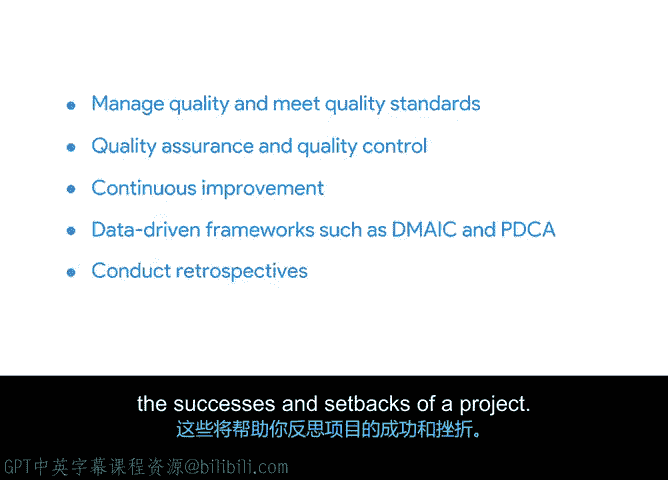

# 013：13_02_01_质量管理与持续改进介绍

欢迎回来。在本课程的这个部分，你将进入下一个主题。我们将向你全面介绍如何管理质量并满足质量标准。你还会学习质量保证和质量控制。我们将探讨持续改进，以及如何使用数据驱动的框架，如**DMAIC**和**PDCA**，来推动持续改进。

此外，你将学习如何进行回顾会议，这有助于你反思项目的成功与挫折。

最后，你将了解在整个过程中保持积极、无指责基调的重要性。

你准备好开始了吗？让我们从质量管理开始。我们下一个视频见。